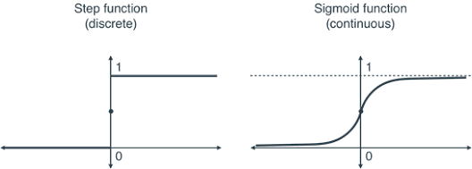

## 목차
✅ CH5-1 선형분류와 퍼셉트론  
✅ CH5-2 sigmoid를 이용한 이진 분류(왜 sigmoid를 쓸까)  
✅ CH5-3 MSE vs likelihood(왜 log-likelihoood를 써야 할까)  
✅ CH5-4 인공신경망은 "MLE기계"이다  
✅ CH5-5 Softmax를 이용한 다중 분류(결곡 MLE라는 뿌리)  
✅ CH5-6 Summary  

## 📚26.09.02 오늘의 TIL

### 1. 선형분류와 퍼셉트론  

 · 퍼셉트론과 선형 분류에서 유닛 스텝 함수(Unit Step Function)와 시그모이드 함수(Sigmoid Function) 비교  
  - 쉽게 말해, 두 함수의 가장 큰 차이는 "모 아니면 도(디지털) 방식으로 끊어서 판단하느냐"와 "부드럽게 확률(아날로그)로 판단하느냐"의 차이  
 
  
  
  - 두 함수의 핵심 차이
  | 구분 | 유닛 스텝 함수 (Unit Step Function) | 시그모이드 함수 (Sigmoid Function)
|--- | --- | --- | 
| 직관적 비유 | 전등 스위치 (On / Off) | 조명 밝기 조절기 (Dimmer)
| 출력 형태 | 오직 0 또는 1 (불연속) | 0과 1 사이의 모든 실수 (연속, S자 곡선)
| 결과 해석 | "너는 무조건 합격(1) 아니면 불합격(0)이야" | "너는 합격할 확률이 **85%(0.85)**야"  
| 수학적 특징 | 경계선(0)에서 미분 불가능, 나머지 구간 미분값 0 | 모든 구간에서 매끄럽게 미분 가능  

 · 퍼셉트론  
  - 스텝 함수는 개념이 직관적이라 초창기 퍼셉트론에 쓰였지만, 컴퓨터를 '학습'시킬 수 없다는 치명적인 한계 때문에 시그모이드로 대체되었음.  

 · 선형함수  
  - 미분 가능성 (학습의 핵심): 인공지능은 틀렸을 때 경사하강법(Gradient Descent)이라는 미분 계산을 통해 스스로 가중치(파라미터)를 수정함, 하지만 스텝 함수는 수직으로 꺾이는 지점에서 미분이 불가능하고, 나머지 평평한 구간은 미분값이 모두 0. 즉, "얼마나 틀렸는지" 피드백을 줄 수 없어 학습이 불가능함. 반면 시그모이드는 부드러운 곡선이라 모든 지점에서 유용한 미분값을 제공함.     
  - 섬세한 '확률적' 정보 제공: 스텝 함수는 50.1점과 99.9점을 똑같이 1(합격)로 처리. 반면 시그모이드는 0.51과 0.999처럼 확신의 정도(확률)를 연속적인 값으로 알려주므로 더 정밀한 판단이 가능  
  - 손실(Loss) 계산의 용이성: 시그모이드는 출력이 부드럽게 변하기 때문에, 정답과 예측값 사이의 오차가 얼마나 큰지 연속적인 손실 함수(Cross-Entropy Loss)로 계산해 점진적으로 정답에 가까워지도록 유도할 수 있음  

  ✔️ 정리: 스텝 함수는 "합격/불합격의 최종 도장만 찍어주는 엄격한 칼cut"이라면, 시그모이드는 "점수에 따라 정답일 확률을 부드럽게 알려주어 컴퓨터가 스스로 피드백을 받고 학습할 수 있게 해주는 도구"이기 때문에 머신러닝 분류 작업에서 훨씬 뛰어남  

### 2. sigmoid를 이용한 이진 분류(왜 sigmoid를 쓸까)  

 · 이진 분류(Binary Classification)에서 Sigmoid 함수는 모델의 계산 결과를 '0에서 1 사이의 확률값'으로 변환해 주는 핵심 도구  

  - 이진 분류에서 Sigmoid 함수의 역할과 존재 이유: 선형 모델은 데이터($x$)에 가중치($w$)와 편향($b$)을 곱해 최종 결과값 $z = wx + b$ 를 계산함. 하지만 이 $z$ 값은 $-\infty$ 부터 $+\infty$ 까지 어떤 숫자든 나올 수 있음  
   🎈 문제점: 이진 분류의 목표는 "이 이메일이 스팸일까, 아닐까?(1 또는 0)"를 판단하는 것. 계산 결과로 $z = +152.4$ 나 $z = -48.1$ 같은 값이 나오면 이를 직관적인 판단 기준으로 쓰기 어려움.  
   🎈 Sigmoid의 역할: Sigmoid 함수는 아무리 크거나 작은 숫자($z$)가 입력되어도 0과 1 사이의 값으로 압축(S자 곡선)시킴  
   🎈 존재 이유: 출력값을 0과 1 사이로 바꿔줌으로써 결과를 "클래스 1(예: 스팸)일 확률"로 해석할 수 있게 됨.(예를 들어 Sigmoid 계산 결과가 0.85라면, "스팸일 확률이 85%"라고 판단할 수 있음. 보통 0.5를 임계값(Threshold)으로 삼아, 0.5 이상이면 1(스팸), 미만이면 0(정상)으로 최종 분류)  

 ·  "지도학습 분류의 기본 = 로지스틱 회귀(Logistic Regression)" 쉽게 풀기  

  - 공부하다 보면 "결국 이진 분류의 기본 형태가 로지스틱 회귀다"라는 말을 접하게 됨. 이름에 '회귀(Regression)'라는 단어가 붙어 있어 오해하기 쉽지만, 로지스틱 회귀는 대표적인 '분류(Classification)' 알고리즘  
  [1. 선형 회귀 단계]   x 입력 -> w*x + b 계산    (숫자 예측)
  [2. Sigmoid 결합] Sigmoid(w*x + b) 적용   (확률로 변환)
  [3. 로지스틱 회귀 완성]   0~1 사이 확률값 출력 -> 0 또는 1 분류   (이진 분류 완료)  

  - 로지스틱 회귀라고 부르는 이유
  1. 선형 회귀의 확장: 로지스틱 회귀의 내부 동작을 보면, 먼저 데이터의 특징을 조합해 점수를 내는 선형 회귀식($z = wx + b$)을 계산  
  2. Sigmoid로 마감: 그 점수($z$)를 Sigmoid 함수에 통과시켜 0~1 사이의 확률값으로 바꿈  
  3. 분류 수행: 완성된 확률값을 바탕으로 0인지 1인지를 분류  
  즉, "선형 회귀(Regression) + Sigmoid = 로지스틱 회귀(Logistic Regression)"가 되는 구조  

  * 로지스틱 회귀란?  
데이터들의 점수를 먼저 계산(선형 회귀)한 뒤, 이를 Sigmoid 함수에 통과시켜 **"1(A그룹)이 될 확률이 몇 %인가?"**를 계산해 최종적으로 0 또는 1로 나눠주는 분류 알고리즘  

 · 지도학습 관점에서의 핵심 요약  
 - 지도학습에서 정답(Label)이 주어진 상태로 모델을 학습시킬 때, 이진 분류 문제의 가장 기본적이고 강력한 기초 모델이 바로 로지스틱 회귀  
  🎈 선형 모델의 단순함과 Sigmoid 함수의 확률 변환 특성이 결합되어, 정답($y=0$ 또는 $1$)과 모델의 예측 확률 사이의 오차를 계산(Cross-Entropy Loss)하고 이를 미분하여 가중치($w$)를 스스로 업데이트해 나감  
  🎈 신경망(Deep Learning)에서도 단일 노드에 Sigmoid 활성화 함수를 적용하면 그것이 곧 로지스틱 회귀 모델과 완벽히 동일  

  ✔️ 정리: Sigmoid는 무한대의 숫자를 0~1 사이의 확률로 바꿔주는 변환기이고, 이 변환기를 선형 식에 붙여 이진 분류를 수행하는 가장 대표적인 지도학습 알고리즘이 바로 로지스틱 회귀.  
   
   ###### feedback  
🔥 오늘 공부하면서 연결해야 할 핵심  
지금까지 배운 것과 오늘 내용이 이렇게 연결된다.  

$$z = Wx + b$$

↓ **Sigmoid**

$$\hat{y} = \sigma(z)$$

↓ **Loss**

$$L(\hat{y}, y)$$

↓ **Backpropagation**

$$\frac{\partial L}{\partial W}$$

↓ **Optimizer**

$$W_{\mathrm{new}} = W_{\mathrm{old}} - \eta \frac{\partial L}{\partial W}$$

즉 4장부터는 지금까지 배운 수학들이 실제 신경망 안에서 어떻게 하나의 시스템으로 연결되는지 보는 단계라고 생각하면 된다.

