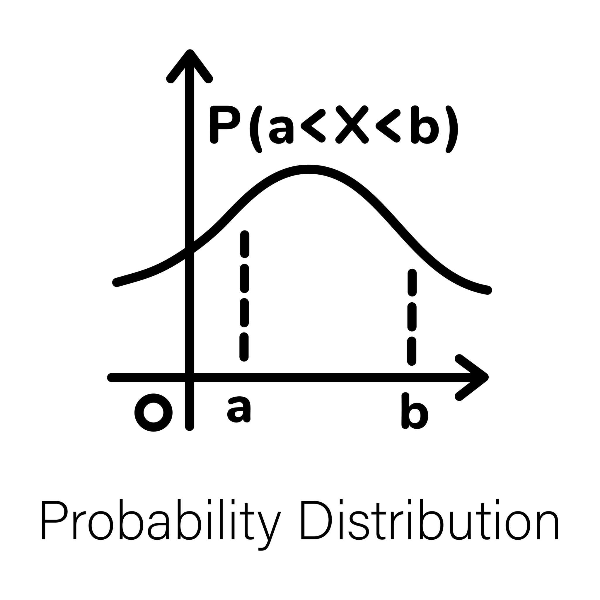

## 목차
✅ CH5-1 선형분류와 퍼셉트론  
✅ CH5-2 sigmoid를 이용한 이진 분류(왜 sigmoid를 쓸까)  
✅ CH5-3 MSE vs likelihood(왜 log-likelihoood를 써야 할까)  
✅ CH5-4 인공신경망은 "MLE기계"이다  
✅ CH5-5 Softmax를 이용한 다중 분류(결곡 MLE라는 뿌리)  
✅ CH5-6 Summary  

## 📚26.09.02 오늘의 TIL

### 1. 선형분류와 퍼셉트론  

 · 퍼셉트론과 선형 분류에서 유닛 스텝 함수(Unit Step Function)와 시그모이드 함수(Sigmoid Function) 비교  
  - 쉽게 말해, 두 함수의 가장 큰 차이는 "모 아니면 도(디지털) 방식으로 끊어서 판단하느냐"와 "부드럽게 확률(아날로그)로 판단하느냐"의 차이  
 
 
 
 
  

  - 두 함수의 핵심 차이  

| 구분 | 유닛 스텝 함수 (Unit Step Function) | 시그모이드 함수 (Sigmoid Function)
|--- | --- | --- | 
| 직관적 비유 | 전등 스위치 (On / Off) | 조명 밝기 조절기 (Dimmer)
| 출력 형태 | 오직 0 또는 1 (불연속) | 0과 1 사이의 모든 실수 (연속, S자 곡선)
| 결과 해석 | "너는 무조건 합격(1) 아니면 불합격(0)이야" | "너는 합격할 확률이 **85%(0.85)**야"  
| 수학적 특징 | 경계선(0)에서 미분 불가능, 나머지 구간 미분값 0 | 모든 구간에서 매끄럽게 미분 가능  

 · 퍼셉트론  
  - 스텝 함수는 개념이 직관적이라 초창기 퍼셉트론에 쓰였지만, 컴퓨터를 '학습'시킬 수 없다는 치명적인 한계 때문에 시그모이드로 대체되었음.  

 · 선형함수  
  - 미분 가능성 (학습의 핵심): 인공지능은 틀렸을 때 경사하강법(Gradient Descent)이라는 미분 계산을 통해 스스로 가중치(파라미터)를 수정함, 하지만 스텝 함수는 수직으로 꺾이는 지점에서 미분이 불가능하고, 나머지 평평한 구간은 미분값이 모두 0. 즉, "얼마나 틀렸는지" 피드백을 줄 수 없어 학습이 불가능함. 반면 시그모이드는 부드러운 곡선이라 모든 지점에서 유용한 미분값을 제공함.     
  - 섬세한 '확률적' 정보 제공: 스텝 함수는 50.1점과 99.9점을 똑같이 1(합격)로 처리. 반면 시그모이드는 0.51과 0.999처럼 확신의 정도(확률)를 연속적인 값으로 알려주므로 더 정밀한 판단이 가능  
  - 손실(Loss) 계산의 용이성: 시그모이드는 출력이 부드럽게 변하기 때문에, 정답과 예측값 사이의 오차가 얼마나 큰지 연속적인 손실 함수(Cross-Entropy Loss)로 계산해 점진적으로 정답에 가까워지도록 유도할 수 있음  

  ✔️ 정리: 스텝 함수는 "합격/불합격의 최종 도장만 찍어주는 엄격한 칼cut"이라면, 시그모이드는 "점수에 따라 정답일 확률을 부드럽게 알려주어 컴퓨터가 스스로 피드백을 받고 학습할 수 있게 해주는 도구"이기 때문에 머신러닝 분류 작업에서 훨씬 뛰어남  

### 2. sigmoid를 이용한 이진 분류(왜 sigmoid를 쓸까)  

 · 이진 분류(Binary Classification)에서 Sigmoid 함수는 모델의 계산 결과를 '0에서 1 사이의 확률값'으로 변환해 주는 핵심 도구  

  - 이진 분류에서 Sigmoid 함수의 역할과 존재 이유: 선형 모델은 데이터($x$)에 가중치($w$)와 편향($b$)을 곱해 최종 결과값 $z = wx + b$ 를 계산함. 하지만 이 $z$ 값은 $-\infty$ 부터 $+\infty$ 까지 어떤 숫자든 나올 수 있음  

   🎈 문제점: 이진 분류의 목표는 "이 이메일이 스팸일까, 아닐까?(1 또는 0)"를 판단하는 것. 계산 결과로 $z = +152.4$ 나 $z = -48.1$ 같은 값이 나오면 이를 직관적인 판단 기준으로 쓰기 어려움.  

   🎈 Sigmoid의 역할: Sigmoid 함수는 아무리 크거나 작은 숫자($z$)가 입력되어도 0과 1 사이의 값으로 압축(S자 곡선)시킴  

   🎈 존재 이유: 출력값을 0과 1 사이로 바꿔줌으로써 결과를 "클래스 1(예: 스팸)일 확률"로 해석할 수 있게 됨.(예를 들어 Sigmoid 계산 결과가 0.85라면, "스팸일 확률이 85%"라고 판단할 수 있음. 보통 0.5를 임계값(Threshold)으로 삼아, 0.5 이상이면 1(스팸), 미만이면 0(정상)으로 최종 분류)  

 ·  "지도학습 분류의 기본 = 로지스틱 회귀(Logistic Regression)" 쉽게 풀기  

  - 공부하다 보면 "결국 이진 분류의 기본 형태가 로지스틱 회귀다"라는 말을 접하게 됨. 이름에 '회귀(Regression)'라는 단어가 붙어 있어 오해하기 쉽지만, 로지스틱 회귀는 대표적인 '분류(Classification)' 알고리즘  
  [1. 선형 회귀 단계]   x 입력 -> w*x + b 계산    (숫자 예측)  
  [2. Sigmoid 결합] Sigmoid(w*x + b) 적용   (확률로 변환)  
  [3. 로지스틱 회귀 완성]   0~1 사이 확률값 출력 -> 0 또는 1 분류   (이진 분류 완료)  

  - 로지스틱 회귀라고 부르는 이유
  1. 선형 회귀의 확장: 로지스틱 회귀의 내부 동작을 보면, 먼저 데이터의 특징을 조합해 점수를 내는 선형 회귀식($z = wx + b$)을 계산  
  2. Sigmoid로 마감: 그 점수($z$)를 Sigmoid 함수에 통과시켜 0~1 사이의 확률값으로 바꿈  
  3. 분류 수행: 완성된 확률값을 바탕으로 0인지 1인지를 분류  
  즉, "선형 회귀(Regression) + Sigmoid = 로지스틱 회귀(Logistic Regression)"가 되는 구조  

  * 로지스틱 회귀란?  
데이터들의 점수를 먼저 계산(선형 회귀)한 뒤, 이를 Sigmoid 함수에 통과시켜 **"1(A그룹)이 될 확률이 몇 %인가?"**를 계산해 최종적으로 0 또는 1로 나눠주는 분류 알고리즘  

 · 지도학습 관점에서의 핵심 요약  
 - 지도학습에서 정답(Label)이 주어진 상태로 모델을 학습시킬 때, 이진 분류 문제의 가장 기본적이고 강력한 기초 모델이 바로 로지스틱 회귀  

  🎈 선형 모델의 단순함과 Sigmoid 함수의 확률 변환 특성이 결합되어, 정답($y=0$ 또는 $1$)과 모델의 예측 확률 사이의 오차를 계산(Cross-Entropy Loss)하고 이를 미분하여 가중치($w$)를 스스로 업데이트해 나감  

  🎈 신경망(Deep Learning)에서도 단일 노드에 Sigmoid 활성화 함수를 적용하면 그것이 곧 로지스틱 회귀 모델과 완벽히 동일  

  ✔️ 정리: Sigmoid는 무한대의 숫자를 0~1 사이의 확률로 바꿔주는 변환기이고, 이 변환기를 선형 식에 붙여 이진 분류를 수행하는 가장 대표적인 지도학습 알고리즘이 바로 로지스틱 회귀.  
   
   ###### feedback  
🔥 오늘 공부하면서 연결해야 할 핵심  
지금까지 배운 것과 오늘 내용이 이렇게 연결된다.  

$$z = Wx + b$$  

    
     ↓ **Sigmoid**  

$$\hat{y} = \sigma(z)$$  

   
      ↓ **Loss**  

$$L(\hat{y}, y)$$  

   
      ↓ **Backpropagation**  

$$\frac{\partial L}{\partial W}$$  

   
      ↓ **Optimizer**  

$$W_{\mathrm{new}} = W_{\mathrm{old}} - \eta \frac{\partial L}{\partial W}$$  
  

즉 4장부터는 지금까지 배운 수학들이 실제 신경망 안에서 어떻게 하나의 시스템으로 연결되는지 보는 단계라고 생각하면 된다.   

## 📚26.09.07 오늘의 TIL

### 3. MSE vs likelihood(왜 log-likelihoood를 써야 할까)  

 · 머신러닝과 통계학에서 모델을 학습시킬 때 그냥 Likelihood(가능도) 대신 Log-likelihood(로그 가능도)를 사용하는 이유는 크게 수학적 편의성, 컴퓨터의 계산 한계 극복, 그리고 최적화의 용이성 때문  

 · 연산의 편리함(곱셈을 가법으로 전환)
  - 독립적인 데이터 $n$개가 주어졌을 때 전체 데이터에 대한 Likelihood는 각 데이터의 확률/확률밀도의 곱으로 표현됨. $$L(\theta) = \prod_{i=1}^{n} P(x_i \mid \theta)$$  
  - 문제점: 곱셈 형태의 식은 미분하기가 매우 까다롭고 자원의 소모가 심함.
  - 해결책: 여기에 로그를 취하면 Log의 성질($\log(ab) = \log a + \log b$)에 의해 곱셈이 덧셈으로 변환됨  

      $$\log L(\theta) = \sum_{i=1}^{n} \log P(x_i \mid \theta)$$  

      덧셈 형태로 바뀐 식은 각 항을 독립적으로 미분하기 훨씬 쉬워짐.  
   
 · 컴퓨터의 언더플로우(Underflow) 방지  
  - 확률 값은 항상 $0 \le P(x) \le 1$ 사이의 작은 소수.  
  - 문제점: 예를 들어 확률이 $0.1$인 사건 1,000개를 곱하면 $0.1^{1000} \approx 0$이 됨. 
  컴퓨터의 메모리는 정밀도에 한계가 있어 너무 작은 수를 $0$으로 처리해버리는데, 이를 Arithmetic Underflow라고 함.  

  해결책: 로그를 취하면 매우 작은 소수 곱셈이 음수의 덧셈으로 바뀌므로 정밀도 손실 없이 수치적으로 안정적인 계산이 가능해짐.  

 · 경사하강법(Gradient Descent) 최적화와의 결합  
  - 머신러닝에서는 보통 손실(Loss)을 최소화하는 방향으로 모델을 학습시킴.  
  - Likelihood는 최대화해야 하는 대상이며, Log-likelihood 에 음수를 취한 Negative Log-Likelihood (NLL)를 정의하면, 이를 최소화하는 문제로 자연스럽게 바꿀 수 있어 경사하강법 알고리즘과 바로 연결됨.  

 · MSE와의 연관성  
Log-likelihood를 쓰면 MSE(Mean Squared Error)와의 접점이 자연스럽게 드러남.  
  - 데이터의 오차가 정규분포(Gaussian Distribution)를 따른다고 가정하고 Log-likelihood를 유도해보면, 
  Log-likelihood를 최대화하는 것이 결국 MSE를 최소화하는 것과 수학적으로 완전히 동일해짐. 즉, MSE는 정규분포 가정을 바탕으로 한 Log-likelihood의 특수한 형태.  

  Likelihood: \(\max_\theta L(\theta)\)  
  Negative Log-Likelihood: \(\min_\theta -\log L(\theta)\)  
  여기서 로그가 중요한 이유는 최댓값을 갖는 θ를 그대로 유지하기 때문.
  즉, Likelihood 최대화 → Log-likelihood 최대화 → NLL 최소화 → Gradient Descent

### 4. 인공신경망은 "MLE기계"이다    

 · 인공신경망을 "MLE(최대우도추정) 기계"라고 부르는 것은 머신러닝의 통계적 본질을 관통하는 핵심 설명. 신경망을 단순한 규칙 계산기가 아니라 조건부 확률 분포를 모델링하는 통계적 도구로 바라보는 시각.  
  
 
 
 
  

 · 확률 분포 모델링 (Probability Distribution Modeling)  
  - 신경망의 출력값은 단순한 고정 숫자가 아니라 특정 확률 분포의 파라미터(Parameter).  
  - 분류 문제 (Classification): 입력 $x$가 주어졌을 때 각 클래스에 속할 확률 분포 $P(y\vert{}x)$ (베르누이 또는 다항 분포)를 출력.  
  - 회귀 문제 (Regression): 입력 $x$가 주어졌을 때 정답 $y$가 따르는 정규분포의 평균 $\mu$ 또는 분산 $\sigma^2$을 출력.  

 · MLE (Maximum Likelihood Estimation, 최대우도추정)  
 - MLE는 관측된 데이터를 발생시켰을 가능성(우도, Likelihood)이 가장 높은 모델 파라미터 $\theta$를 찾는 방법.  
 - 신경망에 수많은 데이터 $(x_i, y_i)$가 입력될 때, 모델이 예측하는 확률 $P(y_i\vert{}x_i; \theta)$들의 곱(전체 우도)을 극대화하는 $\theta$를 찾고자 함.  
 $$\theta_{MLE} = \arg\max_{\theta} \prod_{i=1}^{N} P(y_i \vert{} x_i; \theta)$$  

 · Negative Log-Likelihood (NLL)와 손실 함수  
  - 확률의 곱은 수치적으로 매우 작아져 경사하강법 적용 시 연산 문제가 발생하므로, 로그(Log)를 취해 곱을 합으로 바꾸고 음수(-)를 붙여 최소화 문제로 전환함. 이것이 곧 우리가 사용하는 손실 함수(Loss Function).  
  $$\text{Loss}(\theta) = -\sum_{i=1}^{N} \log P(y_i \vert{} x_i; \theta)$$  
   이 정리가 우리가 흔히 쓰는 손실 함수로 연결됨.

| 문제 유형 | 모델링하는 확률 분포 | MLE로 도출되는 손실 함수
|--- | --- | --- | 
| 이진 분류 (Binary) | 베르누이 분포 (Bernoulli) | Binary Cross-Entropy (BCE)
| 다중 분류 (Multi-class) | 카테고리/다항 분포 (Multinomial) | Categorical Cross-Entropy (CCE)
| 회귀 (Regression) | 정규 분포 (Gaussian, 분산 고정) | Mean Squared Error (MSE)  

   🎈 결론: 신경망 학습의 본질  
   우리가 경사하강법(Gradient Descent)으로 손실 함수를 줄이는 모든 과정은 "우리가 가진 데이터의 확률 분포에 가장 잘 부합하도록 신경망 내부 파라미터 $\theta$를 MLE 방식으로 조정하는 작업"  