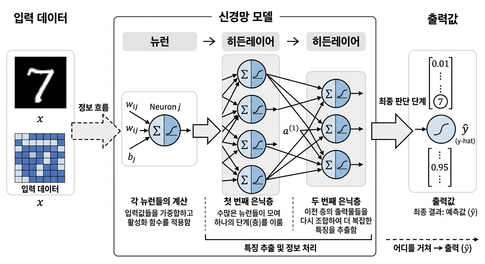
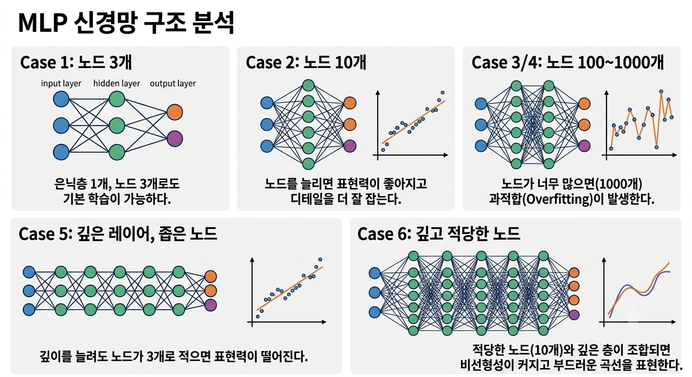

## 목차
✅ CH6-1 Universal Approximation Theorem(왜 하필 인공신경망인가)  
✅ CH6-2 Universal Approximation Theorem(실습을 통한 확인)  
✅ CH6-3 Beautiful insights for ANN(AI가 스스로 학습을 한다는 것의 실체)  


## 📚26.09.10 오늘의 TIL  

선행 지식  
 - 뉴런과 히든레이어 그림으로 알기쉽게 표현
 <p align="center"> 
 
 </p>  

### 1. Universal Approximation Theorem(왜 하필 인공신경망인가)  

 - Universal Approximation Theorem: 보편 근사 정리라고 함
 - 인공신경망이 단순한 매개변수 조합을 넘어, 수학적으로 얼마나 강력한 표현력을 지니고 있는지를 증명하는 대표적인 이론적 기반  

 #### Universal Approximation Theorem의 개념  

  - 핵심 정의: 비선형 활성화 함수를 가진 단 하나의 은닉층(Hidden Layer)을 가진 인공신경망이라도, 은닉층의 뉴런 수가 충분히 많다면 현실 세계의 어떤 연속 함수(Continuous Function)든 원하는 수준의 오차 범위 내로 근사(Approximate)할 수 있음  
  - 직관적 비유: 함수 깍두기 만들기
  · 계단 함수나 Sigmoid, ReLU 같은 활성화 함수를 결합하고 가중치를 조절하면 특정 구간에서만 값이 튀어나오는 레고 블록(또는 계단 형태)을 만들 수 있음  
  · 이 블록들을 충분히 많이 이어 붙이면 복잡하게 굽이치는 곡선이나 고차원 함수 형태를 거의 그대로 복사하듯 따라 할 수 있게 됨  


 #### 왜 하필 '인공신경망'인가?  

 - "세상에 함수를 근사하는 수학적 도구(다항식, 푸리에 변환, 스플라인 등)는 많은데 왜 딥러닝/인공신경망을 사용할까?"에 대한 대답은 다음과 같음  

  - 비선형성(Non-linearity)의 유연함  
  · 선형 모델은 복잡한 데이터 관계를 표현할 수 없지만, 신경망은 간단한 비선형 활성화 함수(ReLU, Sigmoid 등)를 조합해 복잡하고 비선형적인 패턴을 매우 유연하게 포착  

  - 고차원 데이터의 '차원의 curse' 완화 (깊은 신경망의 효율성)    
  · 전통적인 수학적 근사법(예: 테일러 급수)은 데이터의 차원(입력 변수 개수)이 늘어날수록 필요한 항목 수가 폭발적으로 증가  
  · UAT는 은닉층 1개로도 근사가 가능함을 보였지만, 뉴런을 옆으로 늘리는 대신 층을 깊게 쌓는(Deep) 방식을 취하면 훨씬 적은 매개변수만으로도 극도로 높은 차원(이미지, 자연어 등)의 함수를 효율적으로 표현할 수 있음  

  - 경사하강법(Gradient Descent)과의 결합  
  · 신경망은 연쇄 법칙(Chain Rule)을 통한 역전파(Backpropagation)가 가능하도록 미분 가능한 형태로 설계되어 있어, 데이터로부터 스스로 최적의 파라미터를 찾아낼 수 있음   

   #### 이론의 한계와 실전적 의미   

| 구분 | 주요 내용  
|--- | --- |   
| 존재성 보장일 뿐 (Existence, not Construction) | 신경망이 정답 함수를 "표현할  수 있다"는 것을 증명할 뿐, "어떻게 최적의 가중치를 찾을 것인가" 를 알려주지는 않음
| 넓이(Width) vs 깊이(Depth) | 은닉층 1개만 써서 근사하려면 뉴런 수가 무한히 필요해질 수 있음. 따라서 실전에서는 얇고 넓은 네트워크보다 좁고 깊은 네트워크를 사용  
| 학습과 일반화 | 실전 문제에서는 과적합(Overfitting) 이나 국소 최정해(Local Minima)에 빠지는 현상을 극복하기 위한 수많은 테크닉(정규화, Optimizer)이 여전히 요구됨.  


요약하면 Universal Approximation Theorem->  
- UAT는 얕은 신경망만으로도 충분한 조건에서 함수 근사가 가능함을 보여준다.  
- 하지만 실제로는 깊이를 활용하면 특정 종류의 복잡한 함수를 더 효율적으로 표현할 수 있는 경우가 있다.  
- 따라서 UAT 자체가 "Deep Learning이 얕은 네트워크보다 항상 우월하다"는 것을 증명하는 것은 아니다.  

<a href="http://neuralnetworksanddeeplearning.com/chap4.html" target="_blank">직접 확인</a>  


## 📚26.09.14 오늘의 TIL  

### 2. Universal Approximation Theorem(실습을 통한 확인)  

```python
from google.colab import drive
drive.mount('/content/drive')
import sys
sys.path.append('/content/drive/MyDrive/Colab Notebooks')
from multiclass_functions1 import * # my module import
import torch
from torch import nn, optim
import torch.nn.functional as F
import matplotlib.pyplot as plt
DEVICE = "cuda" if torch.cuda.is_available() else "cpu"
print(DEVICE)
```  

```python
BATCH_SIZE = 32
LR = 1e-2
EPOCH = 100
criterion = nn.MSELoss()
new_model_train = True
save_model_path = f"/content/drive/MyDrive/Colab Notebooks/results/UAT.pt"
```  

```python
def Test(model,X_test,Y_test):
    model.eval()
    with torch.no_grad():
        X_test = X_test.to(DEVICE)
        Y_test = Y_test.to(DEVICE)
        # inference
        y_hat = model(X_test)
        # loss
        loss = F.mse_loss(y_hat, Y_test)

    plt.plot(X_test,Y_test,'b:',label="true_curve")
    plt.plot(X_test,y_hat,'r',label="test")
    plt.xlabel("x",fontsize=20)
    plt.ylabel("y",fontsize=20)
    plt.grid()
    plt.legend(fontsize=20)
    plt.xticks(fontsize=20)
    plt.yticks(fontsize=20)
    print(f"Test loss: {loss.item()}")

class Custom_Dataset(torch.utils.data.Dataset):
    def __init__(self, X, Y, transform=None):
        self.X = X
        self.Y = Y
        self.transform = transform

    def __len__(self):
        return self.X.shape[0]

    def __getitem__(self, idx):
        x = self.X[idx]
        if self.transform:
            x = self.transform(x)
        y = self.Y[idx]
        return x, y
```  

```python
# model 선언
class MLP(nn.Module):
    def __init__(self):
        super().__init__()

        # case 1: hidden layer 하나여도 괜찮게 된다! (심지어 노드 3개)
        self.fcs = nn.Sequential(nn.Linear(1, 3),
                                 nn.ReLU(),
                                 nn.Linear(3, 1))

        # case 2: 물론 노드를 늘리면 더 잘한다
        self.fcs = nn.Sequential(nn.Linear(1, 10),
                                 nn.ReLU(),
                                 nn.Linear(10, 1))

        # case 3: 늘릴수록 좀더 부드러워짐
        self.fcs = nn.Sequential(nn.Linear(1, 100),
                                 nn.ReLU(),
                                 nn.Linear(100, 1))

        # case 4: 천개로 늘리면..? 잘되지만 안보여준 data에 대해선 잘 못함 (overfitting)
        self.fcs = nn.Sequential(nn.Linear(1, 1000),
                                 nn.ReLU(),
                                 nn.Linear(1000, 1))

        # case 5: 깊이를 늘려도 노드 수가 너무 적으면 안된다
        self.fcs = nn.Sequential(nn.Linear(1, 3),
                                 nn.ReLU(),
                                 nn.Linear(3, 3),
                                 nn.ReLU(),
                                 nn.Linear(3, 3),
                                 nn.ReLU(),
                                 nn.Linear(3, 3),
                                 nn.ReLU(),
                                 nn.Linear(3, 3),
                                 nn.ReLU(),
                                 nn.Linear(3, 1))

        # case 6-1: 노드 수를 적당히 키우고 깊이를 늘림 (부드럽다!)
        self.fcs = nn.Sequential(nn.Linear(1, 10),
                                 nn.ReLU(),
                                 nn.Linear(10, 10),
                                 nn.ReLU(),
                                 nn.Linear(10, 10),
                                 nn.ReLU(),
                                 nn.Linear(10, 10),
                                 nn.ReLU(),
                                 nn.Linear(10, 10),
                                 nn.ReLU(),
                                 nn.Linear(10, 1))

        # case 6-2: 비교를 위해.. 얕으면 어땠었지?
        # => 노드가 많으면 좀더 사이사이가 좁아져서 디테일을 잘 표현
        #    깊이가 깊으면 nonlinearity가 좀더 커진다고 해석 가능
        self.fcs = nn.Sequential(nn.Linear(1, 10),
                                 nn.ReLU(),
                                 nn.Linear(10, 1))

    def forward(self,x):
        x = torch.flatten(x, start_dim=1)
        x = self.fcs(x)
        return x
```  

```python
# training 과 test 함수 선언, -10부터 10까지 training에 사용 -15부터 15까지 test에 사용 -> 예상되는 결과로는 트레이닝에 사용한 -10부터 10까지 데이터는 테스트 결과가 좋을것임.
X=torch.linspace(-10,10,1000).reshape(-1,1)   # -10부터 10까지 1000개를 쪼개서 x
Y=X**2                                        # x를 제곱하는 트레이닝 함수를 만듬
X_test=torch.linspace(-15,15,1000).reshape(-1,1)    # -15부터 15까지 1000개를 쪼개서 x
Y_test=X_test**2                                    # x를 제곱하는 테스트 함수를 만듬
```  

```python
train_DS = Custom_Dataset(X, Y)
train_DL = torch.utils.data.DataLoader(train_DS, batch_size = BATCH_SIZE, shuffle = True)
```  

```python
model=MLP().to(DEVICE)
print(model)
x_batch, _ = next(iter(train_DL))
print(model(x_batch.to(DEVICE)).shape)
```  

```python
if new_model_train:
    optimizer = optim.Adam(model.parameters(), lr = LR)
    loss_history = Train(model, train_DL, criterion, optimizer, LR=LR, EPOCH=EPOCH)

    torch.save(model, save_model_path)

    plt.figure()
    plt.plot(range(1,EPOCH+1),loss_history)
    plt.xlabel("Epochs")
    plt.ylabel("Loss")
    plt.title("Train Loss")
    plt.grid()
```  

```python
load_model = torch.load(save_model_path, map_location=DEVICE, weights_only=False)
```  

```python
plt.figure(figsize=[15,9])
Test(load_model, X_test, Y_test)
print(count_params(load_model))
```  

```python
# 보여드린 증명 방식대로 훈련되는 것은 아니라는 것 확인!
print(model.fcs[0].weight)
print(model.fcs[0].bias)
print(model.fcs[2].weight)
print(model.fcs[2].bias)
```  


#### MLP 구조에 따른 특징 및 표현력 비교
 <p align="center"> 
 
 </p> 
* **Case 1 (은닉층 1개, 노드 3개)**
  - 은닉층이 하나여도(노드 3개) 기본 학습이 가능하다.

* **Case 2 (은닉층 1개, 노드 10개)**
  - 노드 수를 늘릴수록 표현력이 좋아지고 디테일을 더 잘 학습한다.

* **Case 3 & 4 (은닉층 1개, 노드 100개 / 1,000개)**
  - 노드를 늘릴수록 경계가 부드러워진다.
  - 하지만 1,000개 수준으로 과도하게 늘리면 평가 데이터에 대해 과적합(Overfitting)이 발생한다.

* **Case 5 (깊은 레이어, 노드 3개)**
  - 네트워크 깊이(Depth)를 아무리 늘려도 각 층의 노드가 너무 적으면 성능이 나오지 않는다.

* **Case 6 (깊은 레이어, 노드 10개)**
  - 적당한 노드 수와 깊이가 결합되면 비선형성(Non-linearity)이 극대화되어 부드럽고 정교한 표현이 가능하다.


### 3. Beautiful insights for ANN(AI가 스스로 학습을 한다는 것의 실체)  


# MLP 구조에 따른 특징 및 표현력 비교

* **Case 1 (은닉층 1개, 노드 3개)**
  - 은닉층이 하나여도(노드 3개) 기본 학습이 가능하다.

* **Case 2 (은닉층 1개, 노드 10개)**
  - 노드 수를 늘릴수록 표현력이 좋아지고 디테일을 더 잘 학습한다.

* **Case 3 & 4 (은닉층 1개, 노드 100개 / 1,000개)**
  - 노드를 늘릴수록 경계가 부드러워진다.
  - 하지만 1,000개 수준으로 과도하게 늘리면 평가 데이터에 대해 과적합(Overfitting)이 발생한다.

* **Case 5 (깊은 레이어, 노드 3개)**
  - 네트워크 깊이(Depth)를 아무리 늘려도 각 층의 노드가 너무 적으면 성능이 나오지 않는다.

* **Case 6 (깊은 레이어, 노드 10개)**
  - 적당한 노드 수와 깊이가 결합되면 비선형성(Non-linearity)이 극대화되어 부드럽고 정교한 표현이 가능하다.


