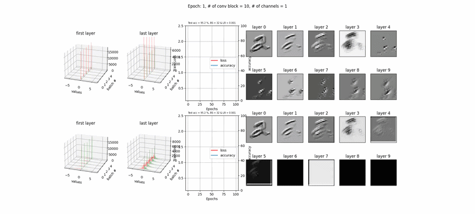
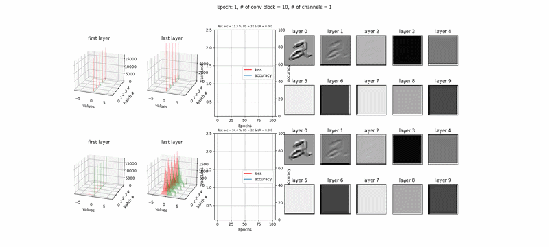
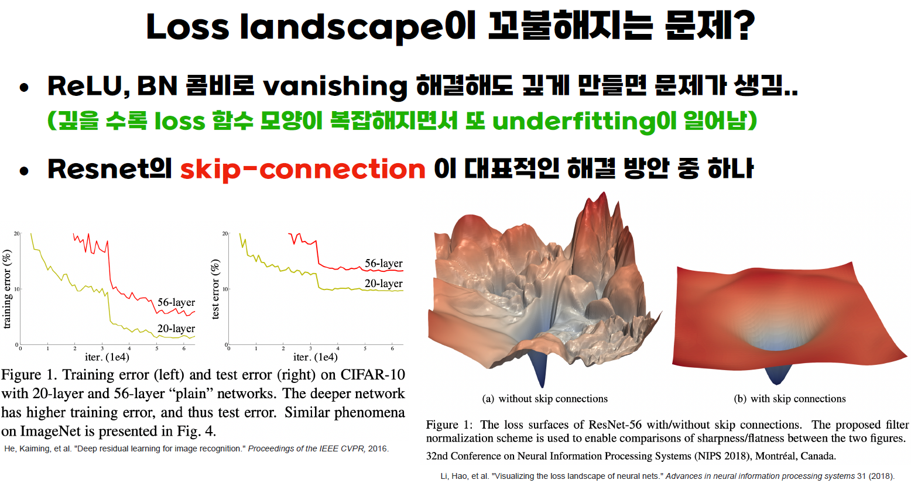

## 목차
✅ CH7-1 직관적으로 이해하는 Vanishing gradient  
✅ CH7-2 Vanishing gradient의 해결 방안(Relu)  
✅ CH7-3 Vanishing gradient 실험(Layer별 Gradient 크기 관찰)  
✅ CH7-4 BN 직관적으로 이해하기 
✅ CH7-5 Batch Normalization 실험  
✅ CH7-6 Loss landscape 문제와 skip-connection  
✅ CH7-7 Loss Landscape 실험  
✅ CH7-8 Overfitting 개념과 Data Argumentation  
✅ CH7-9 Overfitting 방지 방안 - Dropout 개념 및 실험 결과  
✅ CH7-10 Regularization의 개념 및 실험  


## 📚26.09.16 오늘의 TIL  

선행 지식  
 - DNN을 무조건 깊게 만들면 안되는 이유 3가지
 <p align="center"> 
 
 </p>  

### 1. 직관적으로 이해하는 Vanishing gradient  

 #### 기울기 소실(Vanishing Gradient) 문제는 신경망이 깊어질수록 학습 신호가 소멸하여 최적화가 불가능해지는 현상  

 - 직관적 비유: 긴 밧줄 흔들기  
  · 줄 파동: 길고 무거운 밧줄의 한쪽 끝(출력층)에서 손을 잡고 강하게 흔들어도, 밧줄이 너무 길면 파동이 전달되다가 중간에 흡수되어 반대쪽 끝(입력층)에는 아무런 진동도 전달되지 않음  
  · 학습 불능: 뒤쪽(출력층)에서 "오차가 이만큼 발생했으니 수정해!"라고 신호를 보내도, 앞쪽(입력층) 레이어에는 신호가 도착하지 않아 매개변수가 전혀 업데이트되지 않음  

 - 발생 원인: Sigmoid 활성화 함수  
  · 최대 기울기 값의 한계: Sigmoid 함수의 미분값(기울기)은 최대 $0.25$ ($\le 1/4$)  
  · 역전파의 연쇄법칙: 역전파 과정에서는 각 레이어의 기울기를 계속 곱하게 되는데, 레이어가 $N$개라면 $0.25$를 $N$번 곱하게 되므로($0.25^N$), 층이 깊어질수록 기울기가 $0$으로 빠르게 수렴  
  · 사용처의 제한: 따라서 Sigmoid는 깊은 신경망의 은닉층(Hidden Layer)에는 사용할 수 없으며, 출력층의 이진 분류(Binary Classification)용으로만 제한적으로 사용  

 - 결과 및 직관적 핵심: 언더피팅(Underfitting)  
  · 직관적 의미: "앞단에서 입력 데이터를 잘못 처리하면 뒤에서 손쓸 방법이 없다."  
  · 언더피팅 발생: 입력 데이터의 기초 특징을 추출해야 하는 앞쪽 레이어(입력층 근처)가 학습되지 않으므로, 모델이 데이터의 패턴을 전혀 파악하지 못하는 언더피팅(Underfitting) 현상이 발생  

 <p align="center"> 
 
 </p>  

### 2. Vanishing gradient의 해결 방안(Relu)  

 #### 기존에 사용되던 Sigmoid 함수는 입력값이 크거나 작을 때 기울기(미분값)가 0에 가깝게 작아지는 문제가 있어, 이 때문에 신경망이 깊어질수록 역전파 과정에서 기울기가 계속 곱해지면서 입력층으로 갈수록 학습 신호가 거의 사라지는 Vanishing Gradient(기울기 소실) 현상이 발생  

 #### ReLU는 이 문제를 해결하기 위해 등장한 획기적인 활성화 함수. 핵심 원리는 아주 단순함  

 - 양수 입력은 그대로 통과 (f'(양수) = 1)  
  · 입력값 $x$가 0보다 크면, 출력값은 그대로 $x$가 됩니다($f(x)=x$). 이 구간의 미분값(기울기)은 항상 '1'  
  · "계속 중첩되어도 1을 계속 곱하는 것이므로 Sigmoid처럼 '0'으로 수렴하지 않음." 즉, ReLU 활성화 함수 자체는 기울기 소실을 일으키지 않음  

 - ReLU의 또 다른 중요성 (Vanishing Gradient 해결 외)  
  · 계산 효율성 (Computational Efficiency): Sigmoid나 Tanh 함수처럼 지수 함수($e^x$)를 계산할 필요가 없음. 단순히 0과 비교하여 큰 값을 취하는 비교 연산만 수행하므로 학습 속도가 훨씬 빠름. (이는 딥러닝 모델의 대형화에 필수적)  

  · 희소 활성화 (Sparse Activation): 많은 노드의 출력값이 '0'. 이는 실제 뇌의 신경망 작동 방식과 유사하며, 중요한 특징만 활성화시켜 모델의 표현력을 높이고 과적합을 줄이는 효과가 있음. (다만, 0 구간의 기울기가 0이라 학습이 멈추는 Dying ReLU 문제가 있을 수 있으며, 이를 해결하기 위해 Leaky ReLU 등이 사용됨.)

 - 직관적 비유: 긴 밧줄 흔들기  
  · 줄 파동: 길고 무거운 밧줄의 한쪽 끝(출력층)에서 손을 잡고 강하게 흔들어도, 밧줄이 너무 길면 파동이 전달되다가 중간에 흡수되어 반대쪽 끝(입력층)에는 아무런 진동도 전달되지 않음  
  · 학습 불능: 뒤쪽(출력층)에서 "오차가 이만큼 발생했으니 수정해!"라고 신호를 보내도, 앞쪽(입력층) 레이어에는 신호가 도착하지 않아 매개변수가 전혀 업데이트되지 않음  

 <p align="center"> 
 
 </p>  


### 3. Vanishing gradient 실험(Layer별 Gradient 크기 관찰)  

#### Mnist data set을 이용한 분류 실험(Sigmoid 2Layer, 10Layer / Relu 10Layer 총 3가지 비교실험)

##### Sigmoid 2Layer  
 - Sigmoid를 사용하고 2Layer를 쌓아 진행  
 - 비교적 안정적으로 gradient와 weight가 진행됨을 볼 수 있음.  

```python
from google.colab import drive
drive.mount('/content/drive')
import sys
sys.path.append('/content/drive/MyDrive/Colab Notebooks')
from multiclass_functions1 import *
import torch
from torch import nn, optim
import torch.nn.functional as F
from torchvision import datasets,transforms
import numpy as np
import matplotlib.pyplot as plt
DEVICE = "cuda" if torch.cuda.is_available() else "cpu"
print(DEVICE)
```

    Drive already mounted at /content/drive; to attempt to forcibly remount, call drive.mount("/content/drive", force_remount=True).
    cpu
    


```python
# for random seed
# 랜덤한 값들이 규칙성을 가지고 나오게끔 조정해주는 코드(같은 패턴으로 랜던한값)
# ex) 1-3-5-2-5(seed 적용) 이후 다시 랜덤값 적용 시 같은 1-3-5-2-5(seed 적용)
# ex) 2-5-6-5-1-1(seed 미적용) 이후 다시 랜덤값 적용 시 다른 1-6-2-5-2(seed 미적용)
# 일정한 비교를 위한 랜덤 적용
import numpy as np
import random
random_seed = 0
torch.manual_seed(random_seed)
torch.cuda.manual_seed(random_seed)
torch.cuda.manual_seed_all(random_seed) # if use multi-GPU
torch.backends.cudnn.deterministic = True
torch.backends.cudnn.benchmark = False
np.random.seed(random_seed)
random.seed(random_seed)
```


```python
BATCH_SIZE = 256                        # 256개씩 꺼내서
LR = 1e-3                               # LR는 0.001(1 * 10 에 -3제곱 = 0.001)로 설정
EPOCH = 100
NoB = 2                                 # 레이어의 갯수
NoC = 1                                 # 채널의 갯수(노드의 갯수)
criterion = nn.CrossEntropyLoss()       # 분류문제이므로 CE 사용
activation = "Sigmoid"
new_model_train = False
video_save = False
model_type = f"{activation}{NoB}C{NoC}"
save_model_path = f"/content/drive/MyDrive/Colab Notebooks/results/VG/{model_type}_VG_MNIST.pt"
save_video_path = f"/content/drive/MyDrive/Colab Notebooks/results/VG/{model_type}.mp4"
```


```python
transform = transforms.ToTensor()
train_DS = datasets.MNIST(root = '/content/drive/MyDrive/Colab Notebooks/data', train=True, download=True, transform=transform)
test_DS = datasets.MNIST(root = '/content/drive/MyDrive/Colab Notebooks/data', train=False, download=True, transform=transform)
train_DL = torch.utils.data.DataLoader(train_DS, batch_size=BATCH_SIZE, shuffle=True)
test_DL = torch.utils.data.DataLoader(test_DS, batch_size=BATCH_SIZE, shuffle=True)
```


```python
class CNN(nn.Module):
    def __init__(self):
        super().__init__()
        if activation == "Sigmoid":
            self.conv_block = nn.Sequential(
                nn.Conv2d(1,NoC,3, bias=False, padding=1),                                                            # CNN은 nn.Linear=(Fully connected Layer) 대신 nn.Conv2d(Convolution을 사용하는 Layer)를 사용
                nn.Sigmoid(),                                                                                         # Sigmoid 시험
                *[i for j in range(NoB-1) for i in [nn.Conv2d(NoC,NoC,3, bias=False, padding=1), nn.Sigmoid()]]       # Conv - sigmoid - Conv - sigmoid 계속 반복하여 층을 깊게 쌓음(if NoB가 작으면 층을 몇개 안쌓고, 크면 여러 겹 = conv_block)
                )
        elif activation == "BNSigmoid":
            self.conv_block = nn.Sequential(
                nn.Conv2d(1,NoC,3, bias=False, padding=1),
                nn.BatchNorm2d(NoC),
                nn.Sigmoid(),
                *[i for j in range(NoB-1) for i in [nn.Conv2d(NoC,NoC,3, bias=False, padding=1), nn.BatchNorm2d(NoC), nn.Sigmoid()]]
                )
        elif activation == "ReLU":
            self.conv_block = nn.Sequential(
                nn.Conv2d(1,NoC,3, bias=False, padding=1),
                nn.ReLU(),
                *[i for j in range(NoB-1) for i in [nn.Conv2d(NoC,NoC,3, bias=False, padding=1), nn.ReLU()]]
                )
        elif activation == "BNReLU":
            self.conv_block = nn.Sequential(
                nn.Conv2d(1,NoC,3, bias=False, padding=1),
                nn.BatchNorm2d(NoC),
                nn.ReLU(),
                *[i for j in range(NoB-1) for i in [nn.Conv2d(NoC,NoC,3, bias=False, padding=1), nn.BatchNorm2d(NoC), nn.ReLU()]]
                )
        # self.fc = nn.Linear(NoC*(28-2*NoB)*(28-2*NoB),10, bias=False)
        self.maxpool1 = nn.MaxPool2d(2)
        self.maxpool2 = nn.MaxPool2d(2)
        self.fc = nn.Linear(NoC*7*7,10, bias=False)                                                                   # 7*7,10 (10 -> 10개의 노드로 끝냄. ex. 다중분류에서 개, 고양이, 소 면 3 / 현재는 mnnist 숫자 데이터셋이므로 10개)

    def forward(self, x):
        x = self.conv_block(x)
        x = self.maxpool1(x)
        x = self.maxpool2(x)
        x = torch.flatten(x, start_dim=1)
        x = self.fc(x)
        return x
```


```python
model=CNN().to(DEVICE)
print(model)
x_batch, _ = next(iter(train_DL))
print(model(x_batch.to(DEVICE)).shape)
```

    CNN(
      (conv_block): Sequential(
        (0): Conv2d(1, 1, kernel_size=(3, 3), stride=(1, 1), padding=(1, 1), bias=False)
        (1): Sigmoid()
        (2): Conv2d(1, 1, kernel_size=(3, 3), stride=(1, 1), padding=(1, 1), bias=False)
        (3): Sigmoid()
      )
      (maxpool1): MaxPool2d(kernel_size=2, stride=2, padding=0, dilation=1, ceil_mode=False)
      (maxpool2): MaxPool2d(kernel_size=2, stride=2, padding=0, dilation=1, ceil_mode=False)
      (fc): Linear(in_features=49, out_features=10, bias=False)
    )
    torch.Size([256, 10])
    


```python
# Train함수 정의, 모델의 학습
def Train(model, train_DL, criterion):
    optimizer = optim.Adam(model.parameters(), lr=LR)

    loss_history=[]
    acc_history=[]
    mean_grad_history=[]
    mean_weight_history=[]

    NoT=len(train_DL.dataset) # The number of training data

    model.train() # train mode로 전환
    for ep in range(EPOCH):
        rloss = 0 # running loss
        rcorrect = 0 # running correct
        rgrad = torch.zeros(NoB+1) # +1 : 마지막 fc 까지
        rweight = torch.zeros(NoB+1)
        for x_batch, y_batch in train_DL:
            x_batch = x_batch.to(DEVICE)
            y_batch = y_batch.to(DEVICE)
            # inference
            y_hat = model(x_batch)
            # loss
            loss = criterion(y_hat, y_batch)
            # update
            optimizer.zero_grad() # gradient 누적을 막기 위한 초기화
            loss.backward() # backpropagation
            optimizer.step() # weight update
            # loss accumulation
            loss_b = loss.item() * x_batch.shape[0] # batch loss # BATCH_SIZE를 곱하면 마지막 18개도 32개를 곱하니까..
            rloss += loss_b
            # accuracy accumulation
            pred = y_hat.argmax(dim=1)
            corrects_b = torch.sum(pred == y_batch).item()
            rcorrect += corrects_b
            # grad and weight (batch)
            with torch.no_grad():
                wlist = [m.weight for m in model.modules() if isinstance(m,nn.Conv2d) or isinstance(m,nn.Linear)]
                rgrad += torch.tensor([w.grad.abs().sum() * x_batch.shape[0] / w.numel() for w in wlist])  # w.grad.abs() -> abs값에 gradient를 취하고 .sum() -> 그 값들을 더함
                rweight += torch.tensor([w.abs().sum() / w.numel() for w in wlist]) # w.abs() -> weight값에 절대값을 취하고 .sum() -> 그 값들을 더함
                # print(rweight)
        #         break
        # break
        # grad and weight (epoch)
        mean_grad_history += [rgrad/NoT] # 위 값들의 평균 (NoT=train 데이터 갯수)
        mean_weight_history += [rweight/len(train_DL)] # len(train_DL) = Batch 가 몇개인지로 나눠
        # print loss
        loss_e = rloss/NoT # epoch loss
        accuracy_e = rcorrect/NoT * 100
        loss_history += [loss_e]
        acc_history += [accuracy_e]
        print(f"Epoch: {ep+1}, train loss: {round(loss_e,3)}, train accuracy: {round(accuracy_e,1)} %")
        print("-"*20)

    return loss_history, acc_history, mean_grad_history, mean_weight_history
```


```python
if new_model_train:
    loss_history, acc_history, mean_grad_history, mean_weight_history  = Train(model, train_DL, criterion)

    torch.save({"model":model,
                "BATCH_SIZE":BATCH_SIZE,
                "LR":LR,
                "EPOCH":EPOCH,
                "NoB":NoB,
                "NoC":NoC,
                "loss_history":loss_history,
                "acc_history":acc_history,
                "activation":activation,
                "mean_grad_history":mean_grad_history,
                "mean_weight_history":mean_weight_history}, save_model_path)
```


```python
loaded = torch.load(save_model_path, map_location=DEVICE, weights_only=False)
load_model = loaded["model"]
loss_history = loaded["loss_history"]
acc_history = loaded["acc_history"]
mean_grad_history = loaded["mean_grad_history"]
mean_weight_history = loaded["mean_weight_history"]
BATCH_SIZE = loaded["BATCH_SIZE"]
LR = loaded["LR"]
EPOCH = loaded["EPOCH"]
NoB = loaded["NoB"]
NoC = loaded["NoC"]
activation = loaded["activation"]

test_acc = Test(load_model, test_DL)
print(count_params(load_model))
Test_plot(load_model, test_DL)
```

    Test accuracy: 8840/10000 (88.4 %)
    508
    


 <p align="center"> 
 
 </p>    
    


```python
# 각 Layer 별 평균 절대값 시각화
# Vanishing Gradient가 일어난다면, conv1 <- conv2layer <- fc 의 막대가 점점 작아질 것이다.(fc막대가 가장 높고 왼쪽으로 가면서 점점 낮아지는 막대 형성)

fig = plt.figure(figsize=[15, 9])
ymax_grad = max([i.max().item() for i in mean_grad_history])*1.1
ymax_weight = max([i.max().item() for i in mean_weight_history])*1.1
i = 1

plt.suptitle(f"Epoch: {range(1,EPOCH+1)[i]}, Activation = {activation}, # of channels for conv layer = {NoC}")

plt.subplot(2,2,1)
x_axis = [f"conv{i}" for i in range(1,NoB+1)]+["fc"]
plt.bar(x_axis,mean_grad_history[i].cpu(), width=0.8)
plt.ylim([0,ymax_grad])
plt.xlabel("layer")
plt.ylabel("mean absolute value")
plt.title("gradient")

plt.subplot(2,2,2)
x_axis = [f"conv{i}" for i in range(1,NoB+1)]+["fc"]
plt.bar(x_axis,mean_weight_history[i].cpu(), width=0.8)
plt.ylim([0,ymax_weight])
plt.xlabel("layer")
plt.ylabel("mean absolute value")
plt.title("weight")

ax1 = plt.subplot(2,1,2)
ax2 = ax1.twinx()
p1=ax1.plot(range(1,EPOCH+1),loss_history,'r')
p2=ax2.plot(range(1,EPOCH+1),acc_history)
ax1.set_xlim([-5,EPOCH+5])
ax1.set_ylim([min(loss_history)*0.7, max(loss_history)*1.1])
ax2.set_ylim([0, 100])
ax1.set_xlabel("Epochs")
ax1.set_ylabel("Loss")
ax2.set_ylabel("accuracy")
ax1.set_title(f"Train Loss (Final Test accuracy = {test_acc} % with BS = {BATCH_SIZE} & LR = {LR})")
ax1.grid()
plt.legend(p1+p2,["loss", "accuracy"], loc="right")

plt.tight_layout()
```

 <p align="center"> 
 
 </p>  
    
    


```python
# if video_save:
#     from matplotlib.animation import FuncAnimation
#     fig = plt.figure(figsize=[15, 9])
#     ymax_grad = max([i.max().item() for i in mean_grad_history])*1.1
#     ymax_weight = max([i.max().item() for i in mean_weight_history])*1.1
#     def animate(i): # for 문의 i 라고 생각하면 됨
#         plt.clf()

#         plt.suptitle(f"Epoch: {range(1,EPOCH+1)[i]}, Activation = {activation}, # of channels for a conv layer = {NoC}")

#         plt.subplot(2,2,1)
#         x_axis = [f"conv{i}" for i in range(1,NoB+1)]+["fc"]
#         plt.bar(x_axis, mean_grad_history[i].cpu(), width=0.8)
#         plt.ylim([0,ymax_grad])
#         plt.xlabel("layer")
#         plt.ylabel("mean absolute value")
#         plt.title("gradient")

#         plt.subplot(2,2,2)
#         x_axis = [f"conv{i}" for i in range(1,NoB+1)]+["fc"]
#         plt.bar(x_axis, mean_weight_history[i].cpu(), width=0.8)
#         plt.ylim([0,ymax_weight])
#         plt.xlabel("layer")
#         plt.ylabel("mean absolute value")
#         plt.title("weight")

#         ax1 = plt.subplot(2,1,2)
#         ax2 = ax1.twinx()
#         p1=ax1.plot(range(1,EPOCH+1)[:i+1],loss_history[:i+1],'r')
#         p2=ax2.plot(range(1,EPOCH+1)[:i+1],acc_history[:i+1])
#         ax1.set_xlim([-5,EPOCH+5])
#         ax1.set_ylim([min(loss_history)*0.7, max(loss_history)*1.1])
#         ax2.set_ylim([0, 100])
#         ax1.set_xlabel("Epochs")
#         ax1.set_ylabel("Loss")
#         ax2.set_ylabel("accuracy")
#         ax1.set_title(f"Train Loss (Final Test accuracy = {test_acc} % with BS = {BATCH_SIZE} & LR = {LR})")
#         ax1.grid()
#         plt.legend(p1+p2,["loss","accuracy"], loc="right")

#         plt.tight_layout()

#     ani = FuncAnimation(fig, animate, frames=EPOCH, interval=50)
#     # frames 에 10 넣으면 for i in range(10) 이라고 보면 됨. 혹은 list 넣어주면 in list
#     ani.save(save_video_path, writer='imagemagick')
```


##### Sigmoid 10Layer  
 - Sigmoid를 사용하고 10Layer를 쌓아 진행  
 - Layer가 10개로 깊어지니까 학습이 아예 안되는 기울기소실 문제를 겪는것 을 볼 수있음.  

```python
from google.colab import drive
drive.mount('/content/drive')
import sys
sys.path.append('/content/drive/MyDrive/Colab Notebooks')
from multiclass_functions1 import *
import torch
from torch import nn, optim
import torch.nn.functional as F
from torchvision import datasets,transforms
import numpy as np
import matplotlib.pyplot as plt
DEVICE = "cuda" if torch.cuda.is_available() else "cpu"
print(DEVICE)
```

    Drive already mounted at /content/drive; to attempt to forcibly remount, call drive.mount("/content/drive", force_remount=True).
    cpu
    


```python
# for random seed
# 랜덤한 값들이 규칙성을 가지고 나오게끔 조정해주는 코드(같은 패턴으로 랜던한값)
# ex) 1-3-5-2-5(seed 적용) 이후 다시 랜덤값 적용 시 같은 1-3-5-2-5(seed 적용)
# ex) 2-5-6-5-1-1(seed 미적용) 이후 다시 랜덤값 적용 시 다른 1-6-2-5-2(seed 미적용)
# 일정한 비교를 위한 랜덤 적용
import numpy as np
import random
random_seed = 0
torch.manual_seed(random_seed)
torch.cuda.manual_seed(random_seed)
torch.cuda.manual_seed_all(random_seed) # if use multi-GPU
torch.backends.cudnn.deterministic = True
torch.backends.cudnn.benchmark = False
np.random.seed(random_seed)
random.seed(random_seed)
```


```python
BATCH_SIZE = 256                        # 256개씩 꺼내서
LR = 1e-3                               # LR는 0.001(1 * 10 에 -3제곱 = 0.001)로 설정
EPOCH = 100
NoB = 10                                 # 레이어의 갯수
NoC = 1                                 # 채널의 갯수(노드의 갯수)
criterion = nn.CrossEntropyLoss()       # 분류문제이므로 CE 사용
activation = "Sigmoid"
new_model_train = False
video_save = False
model_type = f"{activation}{NoB}C{NoC}"
save_model_path = f"/content/drive/MyDrive/Colab Notebooks/results/VG/{model_type}_VG_MNIST.pt"
save_video_path = f"/content/drive/MyDrive/Colab Notebooks/results/VG/{model_type}.mp4"
```


```python
transform = transforms.ToTensor()
train_DS = datasets.MNIST(root = '/content/drive/MyDrive/Colab Notebooks/data', train=True, download=True, transform=transform)
test_DS = datasets.MNIST(root = '/content/drive/MyDrive/Colab Notebooks/data', train=False, download=True, transform=transform)
train_DL = torch.utils.data.DataLoader(train_DS, batch_size=BATCH_SIZE, shuffle=True)
test_DL = torch.utils.data.DataLoader(test_DS, batch_size=BATCH_SIZE, shuffle=True)
```


```python
class CNN(nn.Module):
    def __init__(self):
        super().__init__()
        if activation == "Sigmoid":
            self.conv_block = nn.Sequential(
                nn.Conv2d(1,NoC,3, bias=False, padding=1),                                                            # CNN은 nn.Linear=(Fully connected Layer) 대신 nn.Conv2d(Convolution을 사용하는 Layer)를 사용
                nn.Sigmoid(),                                                                                         # Sigmoid 시험
                *[i for j in range(NoB-1) for i in [nn.Conv2d(NoC,NoC,3, bias=False, padding=1), nn.Sigmoid()]]       # Conv - sigmoid - Conv - sigmoid 계속 반복하여 층을 깊게 쌓음(if NoB가 작으면 층을 몇개 안쌓고, 크면 여러 겹 = conv_block)
                )
        elif activation == "BNSigmoid":
            self.conv_block = nn.Sequential(
                nn.Conv2d(1,NoC,3, bias=False, padding=1),
                nn.BatchNorm2d(NoC),
                nn.Sigmoid(),
                *[i for j in range(NoB-1) for i in [nn.Conv2d(NoC,NoC,3, bias=False, padding=1), nn.BatchNorm2d(NoC), nn.Sigmoid()]]
                )
        elif activation == "ReLU":
            self.conv_block = nn.Sequential(
                nn.Conv2d(1,NoC,3, bias=False, padding=1),
                nn.ReLU(),
                *[i for j in range(NoB-1) for i in [nn.Conv2d(NoC,NoC,3, bias=False, padding=1), nn.ReLU()]]
                )
        elif activation == "BNReLU":
            self.conv_block = nn.Sequential(
                nn.Conv2d(1,NoC,3, bias=False, padding=1),
                nn.BatchNorm2d(NoC),
                nn.ReLU(),
                *[i for j in range(NoB-1) for i in [nn.Conv2d(NoC,NoC,3, bias=False, padding=1), nn.BatchNorm2d(NoC), nn.ReLU()]]
                )
        # self.fc = nn.Linear(NoC*(28-2*NoB)*(28-2*NoB),10, bias=False)
        self.maxpool1 = nn.MaxPool2d(2)
        self.maxpool2 = nn.MaxPool2d(2)
        self.fc = nn.Linear(NoC*7*7,10, bias=False)                                                                   # 7*7,10 (10 -> 10개의 노드로 끝냄. ex. 다중분류에서 개, 고양이, 소 면 3 / 현재는 mnnist 숫자 데이터셋이므로 10개)

    def forward(self, x):
        x = self.conv_block(x)
        x = self.maxpool1(x)
        x = self.maxpool2(x)
        x = torch.flatten(x, start_dim=1)
        x = self.fc(x)
        return x
```


```python
model=CNN().to(DEVICE)
print(model)
x_batch, _ = next(iter(train_DL))
print(model(x_batch.to(DEVICE)).shape)
```

    CNN(
      (conv_block): Sequential(
        (0): Conv2d(1, 1, kernel_size=(3, 3), stride=(1, 1), padding=(1, 1), bias=False)
        (1): Sigmoid()
        (2): Conv2d(1, 1, kernel_size=(3, 3), stride=(1, 1), padding=(1, 1), bias=False)
        (3): Sigmoid()
        (4): Conv2d(1, 1, kernel_size=(3, 3), stride=(1, 1), padding=(1, 1), bias=False)
        (5): Sigmoid()
        (6): Conv2d(1, 1, kernel_size=(3, 3), stride=(1, 1), padding=(1, 1), bias=False)
        (7): Sigmoid()
        (8): Conv2d(1, 1, kernel_size=(3, 3), stride=(1, 1), padding=(1, 1), bias=False)
        (9): Sigmoid()
        (10): Conv2d(1, 1, kernel_size=(3, 3), stride=(1, 1), padding=(1, 1), bias=False)
        (11): Sigmoid()
        (12): Conv2d(1, 1, kernel_size=(3, 3), stride=(1, 1), padding=(1, 1), bias=False)
        (13): Sigmoid()
        (14): Conv2d(1, 1, kernel_size=(3, 3), stride=(1, 1), padding=(1, 1), bias=False)
        (15): Sigmoid()
        (16): Conv2d(1, 1, kernel_size=(3, 3), stride=(1, 1), padding=(1, 1), bias=False)
        (17): Sigmoid()
        (18): Conv2d(1, 1, kernel_size=(3, 3), stride=(1, 1), padding=(1, 1), bias=False)
        (19): Sigmoid()
      )
      (maxpool1): MaxPool2d(kernel_size=2, stride=2, padding=0, dilation=1, ceil_mode=False)
      (maxpool2): MaxPool2d(kernel_size=2, stride=2, padding=0, dilation=1, ceil_mode=False)
      (fc): Linear(in_features=49, out_features=10, bias=False)
    )
    torch.Size([256, 10])
    


```python
# Train함수 정의, 모델의 학습
def Train(model, train_DL, criterion):
    optimizer = optim.Adam(model.parameters(), lr=LR)

    loss_history=[]
    acc_history=[]
    mean_grad_history=[]
    mean_weight_history=[]

    NoT=len(train_DL.dataset) # The number of training data

    model.train() # train mode로 전환
    for ep in range(EPOCH):
        rloss = 0 # running loss
        rcorrect = 0 # running correct
        rgrad = torch.zeros(NoB+1) # +1 : 마지막 fc 까지
        rweight = torch.zeros(NoB+1)
        for x_batch, y_batch in train_DL:
            x_batch = x_batch.to(DEVICE)
            y_batch = y_batch.to(DEVICE)
            # inference
            y_hat = model(x_batch)
            # loss
            loss = criterion(y_hat, y_batch)
            # update
            optimizer.zero_grad() # gradient 누적을 막기 위한 초기화
            loss.backward() # backpropagation
            optimizer.step() # weight update
            # loss accumulation
            loss_b = loss.item() * x_batch.shape[0] # batch loss # BATCH_SIZE를 곱하면 마지막 18개도 32개를 곱하니까..
            rloss += loss_b
            # accuracy accumulation
            pred = y_hat.argmax(dim=1)
            corrects_b = torch.sum(pred == y_batch).item()
            rcorrect += corrects_b
            # grad and weight (batch)
            with torch.no_grad():
                wlist = [m.weight for m in model.modules() if isinstance(m,nn.Conv2d) or isinstance(m,nn.Linear)]
                rgrad += torch.tensor([w.grad.abs().sum() * x_batch.shape[0] / w.numel() for w in wlist])  # w.grad.abs() -> abs값에 gradient를 취하고 .sum() -> 그 값들을 더함
                rweight += torch.tensor([w.abs().sum() / w.numel() for w in wlist]) # w.abs() -> weight값에 절대값을 취하고 .sum() -> 그 값들을 더함
                # print(rweight)
        #         break
        # break
        # grad and weight (epoch)
        mean_grad_history += [rgrad/NoT] # 위 값들의 평균 (NoT=train 데이터 갯수)
        mean_weight_history += [rweight/len(train_DL)] # len(train_DL) = Batch 가 몇개인지로 나눠
        # print loss
        loss_e = rloss/NoT # epoch loss
        accuracy_e = rcorrect/NoT * 100
        loss_history += [loss_e]
        acc_history += [accuracy_e]
        print(f"Epoch: {ep+1}, train loss: {round(loss_e,3)}, train accuracy: {round(accuracy_e,1)} %")
        print("-"*20)

    return loss_history, acc_history, mean_grad_history, mean_weight_history
```


```python
if new_model_train:
    loss_history, acc_history, mean_grad_history, mean_weight_history  = Train(model, train_DL, criterion)

    torch.save({"model":model,
                "BATCH_SIZE":BATCH_SIZE,
                "LR":LR,
                "EPOCH":EPOCH,
                "NoB":NoB,
                "NoC":NoC,
                "loss_history":loss_history,
                "acc_history":acc_history,
                "activation":activation,
                "mean_grad_history":mean_grad_history,
                "mean_weight_history":mean_weight_history}, save_model_path)
```


```python
loaded = torch.load(save_model_path, map_location=DEVICE, weights_only=False)
load_model = loaded["model"]
loss_history = loaded["loss_history"]
acc_history = loaded["acc_history"]
mean_grad_history = loaded["mean_grad_history"]
mean_weight_history = loaded["mean_weight_history"]
BATCH_SIZE = loaded["BATCH_SIZE"]
LR = loaded["LR"]
EPOCH = loaded["EPOCH"]
NoB = loaded["NoB"]
NoC = loaded["NoC"]
activation = loaded["activation"]

test_acc = Test(load_model, test_DL)
print(count_params(load_model))
Test_plot(load_model, test_DL)
```

    Test accuracy: 1135/10000 (11.3 %)
    580
    

 <p align="center"> 
 
 </p>  
    
    
    


```python
# 각 Layer 별 평균 절대값 시각화
# Vanishing Gradient가 일어난다면, conv1 <- conv2layer <- fc 의 막대가 점점 작아질 것이다.(fc막대가 가장 높고 왼쪽으로 가면서 점점 낮아지는 막대 형성)

fig = plt.figure(figsize=[15, 9])
ymax_grad = max([i.max().item() for i in mean_grad_history])*1.1
ymax_weight = max([i.max().item() for i in mean_weight_history])*1.1
i = 1

plt.suptitle(f"Epoch: {range(1,EPOCH+1)[i]}, Activation = {activation}, # of channels for conv layer = {NoC}")

plt.subplot(2,2,1)
x_axis = [f"conv{i}" for i in range(1,NoB+1)]+["fc"]
plt.bar(x_axis,mean_grad_history[i].cpu(), width=0.8)
plt.ylim([0,ymax_grad])
plt.xlabel("layer")
plt.ylabel("mean absolute value")
plt.title("gradient")

plt.subplot(2,2,2)
x_axis = [f"conv{i}" for i in range(1,NoB+1)]+["fc"]
plt.bar(x_axis,mean_weight_history[i].cpu(), width=0.8)
plt.ylim([0,ymax_weight])
plt.xlabel("layer")
plt.ylabel("mean absolute value")
plt.title("weight")

ax1 = plt.subplot(2,1,2)
ax2 = ax1.twinx()
p1=ax1.plot(range(1,EPOCH+1),loss_history,'r')
p2=ax2.plot(range(1,EPOCH+1),acc_history)
ax1.set_xlim([-5,EPOCH+5])
ax1.set_ylim([min(loss_history)*0.7, max(loss_history)*1.1])
ax2.set_ylim([0, 100])
ax1.set_xlabel("Epochs")
ax1.set_ylabel("Loss")
ax2.set_ylabel("accuracy")
ax1.set_title(f"Train Loss (Final Test accuracy = {test_acc} % with BS = {BATCH_SIZE} & LR = {LR})")
ax1.grid()
plt.legend(p1+p2,["loss", "accuracy"], loc="right")

plt.tight_layout()
```

 <p align="center"> 
 
 </p>  
    


```python
# if video_save:
#     from matplotlib.animation import FuncAnimation
#     fig = plt.figure(figsize=[15, 9])
#     ymax_grad = max([i.max().item() for i in mean_grad_history])*1.1
#     ymax_weight = max([i.max().item() for i in mean_weight_history])*1.1
#     def animate(i): # for 문의 i 라고 생각하면 됨
#         plt.clf()

#         plt.suptitle(f"Epoch: {range(1,EPOCH+1)[i]}, Activation = {activation}, # of channels for a conv layer = {NoC}")

#         plt.subplot(2,2,1)
#         x_axis = [f"conv{i}" for i in range(1,NoB+1)]+["fc"]
#         plt.bar(x_axis, mean_grad_history[i].cpu(), width=0.8)
#         plt.ylim([0,ymax_grad])
#         plt.xlabel("layer")
#         plt.ylabel("mean absolute value")
#         plt.title("gradient")

#         plt.subplot(2,2,2)
#         x_axis = [f"conv{i}" for i in range(1,NoB+1)]+["fc"]
#         plt.bar(x_axis, mean_weight_history[i].cpu(), width=0.8)
#         plt.ylim([0,ymax_weight])
#         plt.xlabel("layer")
#         plt.ylabel("mean absolute value")
#         plt.title("weight")

#         ax1 = plt.subplot(2,1,2)
#         ax2 = ax1.twinx()
#         p1=ax1.plot(range(1,EPOCH+1)[:i+1],loss_history[:i+1],'r')
#         p2=ax2.plot(range(1,EPOCH+1)[:i+1],acc_history[:i+1])
#         ax1.set_xlim([-5,EPOCH+5])
#         ax1.set_ylim([min(loss_history)*0.7, max(loss_history)*1.1])
#         ax2.set_ylim([0, 100])
#         ax1.set_xlabel("Epochs")
#         ax1.set_ylabel("Loss")
#         ax2.set_ylabel("accuracy")
#         ax1.set_title(f"Train Loss (Final Test accuracy = {test_acc} % with BS = {BATCH_SIZE} & LR = {LR})")
#         ax1.grid()
#         plt.legend(p1+p2,["loss","accuracy"], loc="right")

#         plt.tight_layout()

#     ani = FuncAnimation(fig, animate, frames=EPOCH, interval=50)
#     # frames 에 10 넣으면 for i in range(10) 이라고 보면 됨. 혹은 list 넣어주면 in list
#     ani.save(save_video_path, writer='imagemagick')
```


##### Relu 10Layer  
 - Relu를 사용하고 10Layer를 쌓아 진행  
 - 매우 안정적으로 gradient와 weight가 진행되며, 2Epoch부터 Loss는 완전 바닥, Accuracy는 무려 99%를 달성하는 안정적 모습을 볼 수 있음.  

```python
from google.colab import drive
drive.mount('/content/drive')
import sys
sys.path.append('/content/drive/MyDrive/Colab Notebooks')
from multiclass_functions1 import *
import torch
from torch import nn, optim
import torch.nn.functional as F
from torchvision import datasets,transforms
import numpy as np
import matplotlib.pyplot as plt
DEVICE = "cuda" if torch.cuda.is_available() else "cpu"
print(DEVICE)
```

    Drive already mounted at /content/drive; to attempt to forcibly remount, call drive.mount("/content/drive", force_remount=True).
    cpu
    


```python
# for random seed
# 랜덤한 값들이 규칙성을 가지고 나오게끔 조정해주는 코드(같은 패턴으로 랜던한값)
# ex) 1-3-5-2-5(seed 적용) 이후 다시 랜덤값 적용 시 같은 1-3-5-2-5(seed 적용)
# ex) 2-5-6-5-1-1(seed 미적용) 이후 다시 랜덤값 적용 시 다른 1-6-2-5-2(seed 미적용)
# 일정한 비교를 위한 랜덤 적용
import numpy as np
import random
random_seed = 0
torch.manual_seed(random_seed)
torch.cuda.manual_seed(random_seed)
torch.cuda.manual_seed_all(random_seed) # if use multi-GPU
torch.backends.cudnn.deterministic = True
torch.backends.cudnn.benchmark = False
np.random.seed(random_seed)
random.seed(random_seed)
```


```python
BATCH_SIZE = 256                        # 256개씩 꺼내서
LR = 1e-3                               # LR는 0.001(1 * 10 에 -3제곱 = 0.001)로 설정
EPOCH = 100
NoB = 10                                 # 레이어의 갯수
NoC = 1                                 # 채널의 갯수(노드의 갯수)
criterion = nn.CrossEntropyLoss()       # 분류문제이므로 CE 사용
activation = "ReLU"
new_model_train = False
video_save = False
model_type = f"{activation}{NoB}C{NoC}"
save_model_path = f"/content/drive/MyDrive/Colab Notebooks/results/VG/{model_type}_VG_MNIST.pt"
save_video_path = f"/content/drive/MyDrive/Colab Notebooks/results/VG/{model_type}.mp4"
```


```python
transform = transforms.ToTensor()
train_DS = datasets.MNIST(root = '/content/drive/MyDrive/Colab Notebooks/data', train=True, download=True, transform=transform)
test_DS = datasets.MNIST(root = '/content/drive/MyDrive/Colab Notebooks/data', train=False, download=True, transform=transform)
train_DL = torch.utils.data.DataLoader(train_DS, batch_size=BATCH_SIZE, shuffle=True)
test_DL = torch.utils.data.DataLoader(test_DS, batch_size=BATCH_SIZE, shuffle=True)
```


```python
class CNN(nn.Module):
    def __init__(self):
        super().__init__()
        if activation == "Sigmoid":
            self.conv_block = nn.Sequential(
                nn.Conv2d(1,NoC,3, bias=False, padding=1),                                                            # CNN은 nn.Linear=(Fully connected Layer) 대신 nn.Conv2d(Convolution을 사용하는 Layer)를 사용
                nn.Sigmoid(),                                                                                         # Sigmoid 시험
                *[i for j in range(NoB-1) for i in [nn.Conv2d(NoC,NoC,3, bias=False, padding=1), nn.Sigmoid()]]       # Conv - sigmoid - Conv - sigmoid 계속 반복하여 층을 깊게 쌓음(if NoB가 작으면 층을 몇개 안쌓고, 크면 여러 겹 = conv_block)
                )
        elif activation == "BNSigmoid":
            self.conv_block = nn.Sequential(
                nn.Conv2d(1,NoC,3, bias=False, padding=1),
                nn.BatchNorm2d(NoC),
                nn.Sigmoid(),
                *[i for j in range(NoB-1) for i in [nn.Conv2d(NoC,NoC,3, bias=False, padding=1), nn.BatchNorm2d(NoC), nn.Sigmoid()]]
                )
        elif activation == "ReLU":
            self.conv_block = nn.Sequential(
                nn.Conv2d(1,NoC,3, bias=False, padding=1),
                nn.ReLU(),
                *[i for j in range(NoB-1) for i in [nn.Conv2d(NoC,NoC,3, bias=False, padding=1), nn.ReLU()]]
                )
        elif activation == "BNReLU":
            self.conv_block = nn.Sequential(
                nn.Conv2d(1,NoC,3, bias=False, padding=1),
                nn.BatchNorm2d(NoC),
                nn.ReLU(),
                *[i for j in range(NoB-1) for i in [nn.Conv2d(NoC,NoC,3, bias=False, padding=1), nn.BatchNorm2d(NoC), nn.ReLU()]]
                )
        # self.fc = nn.Linear(NoC*(28-2*NoB)*(28-2*NoB),10, bias=False)
        self.maxpool1 = nn.MaxPool2d(2)
        self.maxpool2 = nn.MaxPool2d(2)
        self.fc = nn.Linear(NoC*7*7,10, bias=False)                                                                   # 7*7,10 (10 -> 10개의 노드로 끝냄. ex. 다중분류에서 개, 고양이, 소 면 3 / 현재는 mnnist 숫자 데이터셋이므로 10개)

    def forward(self, x):
        x = self.conv_block(x)
        x = self.maxpool1(x)
        x = self.maxpool2(x)
        x = torch.flatten(x, start_dim=1)
        x = self.fc(x)
        return x
```


```python
model=CNN().to(DEVICE)
print(model)
x_batch, _ = next(iter(train_DL))
print(model(x_batch.to(DEVICE)).shape)
```

    CNN(
      (conv_block): Sequential(
        (0): Conv2d(1, 1, kernel_size=(3, 3), stride=(1, 1), padding=(1, 1), bias=False)
        (1): ReLU()
        (2): Conv2d(1, 1, kernel_size=(3, 3), stride=(1, 1), padding=(1, 1), bias=False)
        (3): ReLU()
        (4): Conv2d(1, 1, kernel_size=(3, 3), stride=(1, 1), padding=(1, 1), bias=False)
        (5): ReLU()
        (6): Conv2d(1, 1, kernel_size=(3, 3), stride=(1, 1), padding=(1, 1), bias=False)
        (7): ReLU()
        (8): Conv2d(1, 1, kernel_size=(3, 3), stride=(1, 1), padding=(1, 1), bias=False)
        (9): ReLU()
        (10): Conv2d(1, 1, kernel_size=(3, 3), stride=(1, 1), padding=(1, 1), bias=False)
        (11): ReLU()
        (12): Conv2d(1, 1, kernel_size=(3, 3), stride=(1, 1), padding=(1, 1), bias=False)
        (13): ReLU()
        (14): Conv2d(1, 1, kernel_size=(3, 3), stride=(1, 1), padding=(1, 1), bias=False)
        (15): ReLU()
        (16): Conv2d(1, 1, kernel_size=(3, 3), stride=(1, 1), padding=(1, 1), bias=False)
        (17): ReLU()
        (18): Conv2d(1, 1, kernel_size=(3, 3), stride=(1, 1), padding=(1, 1), bias=False)
        (19): ReLU()
      )
      (maxpool1): MaxPool2d(kernel_size=2, stride=2, padding=0, dilation=1, ceil_mode=False)
      (maxpool2): MaxPool2d(kernel_size=2, stride=2, padding=0, dilation=1, ceil_mode=False)
      (fc): Linear(in_features=49, out_features=10, bias=False)
    )
    torch.Size([256, 10])
    


```python
# Train함수 정의, 모델의 학습
def Train(model, train_DL, criterion):
    optimizer = optim.Adam(model.parameters(), lr=LR)

    loss_history=[]
    acc_history=[]
    mean_grad_history=[]
    mean_weight_history=[]

    NoT=len(train_DL.dataset) # The number of training data

    model.train() # train mode로 전환
    for ep in range(EPOCH):
        rloss = 0 # running loss
        rcorrect = 0 # running correct
        rgrad = torch.zeros(NoB+1) # +1 : 마지막 fc 까지
        rweight = torch.zeros(NoB+1)
        for x_batch, y_batch in train_DL:
            x_batch = x_batch.to(DEVICE)
            y_batch = y_batch.to(DEVICE)
            # inference
            y_hat = model(x_batch)
            # loss
            loss = criterion(y_hat, y_batch)
            # update
            optimizer.zero_grad() # gradient 누적을 막기 위한 초기화
            loss.backward() # backpropagation
            optimizer.step() # weight update
            # loss accumulation
            loss_b = loss.item() * x_batch.shape[0] # batch loss # BATCH_SIZE를 곱하면 마지막 18개도 32개를 곱하니까..
            rloss += loss_b
            # accuracy accumulation
            pred = y_hat.argmax(dim=1)
            corrects_b = torch.sum(pred == y_batch).item()
            rcorrect += corrects_b
            # grad and weight (batch)
            with torch.no_grad():
                wlist = [m.weight for m in model.modules() if isinstance(m,nn.Conv2d) or isinstance(m,nn.Linear)]
                rgrad += torch.tensor([w.grad.abs().sum() * x_batch.shape[0] / w.numel() for w in wlist])  # w.grad.abs() -> abs값에 gradient를 취하고 .sum() -> 그 값들을 더함
                rweight += torch.tensor([w.abs().sum() / w.numel() for w in wlist]) # w.abs() -> weight값에 절대값을 취하고 .sum() -> 그 값들을 더함
                # print(rweight)
        #         break
        # break
        # grad and weight (epoch)
        mean_grad_history += [rgrad/NoT] # 위 값들의 평균 (NoT=train 데이터 갯수)
        mean_weight_history += [rweight/len(train_DL)] # len(train_DL) = Batch 가 몇개인지로 나눠
        # print loss
        loss_e = rloss/NoT # epoch loss
        accuracy_e = rcorrect/NoT * 100
        loss_history += [loss_e]
        acc_history += [accuracy_e]
        print(f"Epoch: {ep+1}, train loss: {round(loss_e,3)}, train accuracy: {round(accuracy_e,1)} %")
        print("-"*20)

    return loss_history, acc_history, mean_grad_history, mean_weight_history
```


```python
if new_model_train:
    loss_history, acc_history, mean_grad_history, mean_weight_history  = Train(model, train_DL, criterion)

    torch.save({"model":model,
                "BATCH_SIZE":BATCH_SIZE,
                "LR":LR,
                "EPOCH":EPOCH,
                "NoB":NoB,
                "NoC":NoC,
                "loss_history":loss_history,
                "acc_history":acc_history,
                "activation":activation,
                "mean_grad_history":mean_grad_history,
                "mean_weight_history":mean_weight_history}, save_model_path)
```


```python
loaded = torch.load(save_model_path, map_location=DEVICE, weights_only=False)
load_model = loaded["model"]
loss_history = loaded["loss_history"]
acc_history = loaded["acc_history"]
mean_grad_history = loaded["mean_grad_history"]
mean_weight_history = loaded["mean_weight_history"]
BATCH_SIZE = loaded["BATCH_SIZE"]
LR = loaded["LR"]
EPOCH = loaded["EPOCH"]
NoB = loaded["NoB"]
NoC = loaded["NoC"]
activation = loaded["activation"]

test_acc = Test(load_model, test_DL)
print(count_params(load_model))
Test_plot(load_model, test_DL)
```

    Test accuracy: 9534/10000 (95.3 %)
    580
    

 <p align="center"> 
 
 </p>  
    


```python
# 각 Layer 별 평균 절대값 시각화
# Vanishing Gradient가 일어난다면, conv1 <- conv2layer <- fc 의 막대가 점점 작아질 것이다.(fc막대가 가장 높고 왼쪽으로 가면서 점점 낮아지는 막대 형성)

fig = plt.figure(figsize=[15, 9])
ymax_grad = max([i.max().item() for i in mean_grad_history])*1.1
ymax_weight = max([i.max().item() for i in mean_weight_history])*1.1
i = 1

plt.suptitle(f"Epoch: {range(1,EPOCH+1)[i]}, Activation = {activation}, # of channels for conv layer = {NoC}")

plt.subplot(2,2,1)
x_axis = [f"conv{i}" for i in range(1,NoB+1)]+["fc"]
plt.bar(x_axis,mean_grad_history[i].cpu(), width=0.8)
plt.ylim([0,ymax_grad])
plt.xlabel("layer")
plt.ylabel("mean absolute value")
plt.title("gradient")

plt.subplot(2,2,2)
x_axis = [f"conv{i}" for i in range(1,NoB+1)]+["fc"]
plt.bar(x_axis,mean_weight_history[i].cpu(), width=0.8)
plt.ylim([0,ymax_weight])
plt.xlabel("layer")
plt.ylabel("mean absolute value")
plt.title("weight")

ax1 = plt.subplot(2,1,2)
ax2 = ax1.twinx()
p1=ax1.plot(range(1,EPOCH+1),loss_history,'r')
p2=ax2.plot(range(1,EPOCH+1),acc_history)
ax1.set_xlim([-5,EPOCH+5])
ax1.set_ylim([min(loss_history)*0.7, max(loss_history)*1.1])
ax2.set_ylim([0, 100])
ax1.set_xlabel("Epochs")
ax1.set_ylabel("Loss")
ax2.set_ylabel("accuracy")
ax1.set_title(f"Train Loss (Final Test accuracy = {test_acc} % with BS = {BATCH_SIZE} & LR = {LR})")
ax1.grid()
plt.legend(p1+p2,["loss", "accuracy"], loc="right")

plt.tight_layout()
```

 <p align="center"> 
 
 </p>  
    
    


```python
# if video_save:
#     from matplotlib.animation import FuncAnimation
#     fig = plt.figure(figsize=[15, 9])
#     ymax_grad = max([i.max().item() for i in mean_grad_history])*1.1
#     ymax_weight = max([i.max().item() for i in mean_weight_history])*1.1
#     def animate(i): # for 문의 i 라고 생각하면 됨
#         plt.clf()

#         plt.suptitle(f"Epoch: {range(1,EPOCH+1)[i]}, Activation = {activation}, # of channels for a conv layer = {NoC}")

#         plt.subplot(2,2,1)
#         x_axis = [f"conv{i}" for i in range(1,NoB+1)]+["fc"]
#         plt.bar(x_axis, mean_grad_history[i].cpu(), width=0.8)
#         plt.ylim([0,ymax_grad])
#         plt.xlabel("layer")
#         plt.ylabel("mean absolute value")
#         plt.title("gradient")

#         plt.subplot(2,2,2)
#         x_axis = [f"conv{i}" for i in range(1,NoB+1)]+["fc"]
#         plt.bar(x_axis, mean_weight_history[i].cpu(), width=0.8)
#         plt.ylim([0,ymax_weight])
#         plt.xlabel("layer")
#         plt.ylabel("mean absolute value")
#         plt.title("weight")

#         ax1 = plt.subplot(2,1,2)
#         ax2 = ax1.twinx()
#         p1=ax1.plot(range(1,EPOCH+1)[:i+1],loss_history[:i+1],'r')
#         p2=ax2.plot(range(1,EPOCH+1)[:i+1],acc_history[:i+1])
#         ax1.set_xlim([-5,EPOCH+5])
#         ax1.set_ylim([min(loss_history)*0.7, max(loss_history)*1.1])
#         ax2.set_ylim([0, 100])
#         ax1.set_xlabel("Epochs")
#         ax1.set_ylabel("Loss")
#         ax2.set_ylabel("accuracy")
#         ax1.set_title(f"Train Loss (Final Test accuracy = {test_acc} % with BS = {BATCH_SIZE} & LR = {LR})")
#         ax1.grid()
#         plt.legend(p1+p2,["loss","accuracy"], loc="right")

#         plt.tight_layout()

#     ani = FuncAnimation(fig, animate, frames=EPOCH, interval=50)
#     # frames 에 10 넣으면 for i in range(10) 이라고 보면 됨. 혹은 list 넣어주면 in list
#     ani.save(save_video_path, writer='imagemagick')
```  


## 📚26.09.17 오늘의 TIL  

선행 지식  
 - BN
 <p align="center"> 
 
 </p>  

#### 배치 정규화 핵심 필수 용어

 - Batch Size (배치 크기)  
 · 개념: 모델이 한 번에 모아서 학습하는 데이터 묶음의 개수  
 · 이유: 데이터 1개씩 정규화하면 평균/분산을 구하기 어렵고, 전체 데이터를 다 넣으면 메모리가 터짐. 적당한 묶음(예: 32, 64개) 단위로 평균과 분산을 구함  

 - Mini-batch (미니배치)  
 · 개념: 전체 데이터셋을 Batch Size만큼 쪼개놓은 실제 하나의 데이터 묶음 단편  
 
 - Internal Covariate Shift (내부 공변량 변화)  
 · 개념: 신경망 학습 과정에서 앞쪽 레이어의 가중치가 바뀜에 따라, 뒤쪽 레이어로 들어오는 입력 데이터의 분포가 계속 흔들리고 변하는 현상 (학습을 방해하는 주범)  
 
 - Gamma (γ) & Beta (β) (스케일 및 시프트 파라미터)  
 · 개념: 데이터를 평균 0, 분산 1로만 딱 고정해 버리면 신경망이 다양한 표현을 하지 못하고 비선형성을 잃어버림  
 · 역할: 정규화된 값에 γ를 곱해 크기(Scale)를 조절하고, β를 더해 위치(Shift)를 이동시켜 모델이 최적의 데이터 형태를 직접 학습하게 해줌  

배치 정규화는 "배치(Batch Size) 단위로 데이터의 평균과 분산을 구해 정규화한 뒤, γ와 β로 형태를 살짝 변형해 딥러닝 학습을 빠르게 만드는 기법"으로 정리함  


### 4. BN 직관적으로 이해하기  

 #### 기울기 소실(Vanishing Gradient) 을 해결하는 두번째 방법 - Batch Normalization  
#### 1. Batch Normalization이란?
**Batch Normalization(BN, 배치 정규화)**은 신경망 내부에서 전달되는 값들의 분포를 정규화하여 **학습을 안정화하고 빠른 수렴에 도움을 주는 기법**이다.  

핵심 아이디어는 다음과 같다.  
> **Batch 단위로 평균과 분산을 계산하여 값을 평균 0, 분산 1에 가깝게 정규화한 후, 학습 가능한 γ와 β를 이용해 필요한 크기와 위치로 다시 조정한다.**  
즉, $$x\rightarrow\text{Normalization}\rightarrow\gamma\hat{x}+\beta\rightarrow y$$ 의 과정을 거친다.  

#### 2. 왜 Batch Normalization이 필요한가?  

신경망이 깊어질수록 각 층을 거치면서 활성값(activation)의 크기와 분포가 계속 변할 수 있다.  

예를 들어 어떤 층의 값이 $$0.1,\ 0.3,\ 0.2,\ 0.4$$ 정도였다가 학습 과정에서 $$10,\ 30,\ 20,\ 40$$ 처럼 크게 변할 수도 있다.  
이처럼 값의 분포가 지나치게 변하면 다음 층의 학습이 불안정해질 수 있다.  
따라서 BN은 신경망 내부의 활성값을 **적절한 분포로 정리하여 학습을 안정화하는 데 도움**을 준다.  


#### 3. Batch Normalization의 기본 과정  

Batch에 \(m\)개의 값이 들어왔다고 하자.  
$$x_1,x_2,\cdots,x_m$$ 

 - ① Batch 평균 계산  
$$\mu_B=\frac{1}{m}\sum_{i=1}^{m}x_i$$

 - ② Batch 분산 계산    
 $$\sigma_B^2=\frac{1}{m}\sum_{i=1}^{m}(x_i-\mu_B)^2$$  
 
 - ③ Normalization  
 $$\hat{x}_i=\frac{x_i-\mu_B}{\sqrt{\sigma_B^2+\epsilon}}$$  

 이 과정을 통해 정규화된 값은 대략 $$E[\hat{x}]\approx0$$  $$Var(\hat{x})\approx1$$ 이 되도록 한다.  

즉, **평균을 빼고 표준편차로 나누어 값을 0을 중심으로 재배치하고 스케일을 조정하는 것**


#### 4. 그런데 왜 γ와 β를 다시 사용하는가?  
Normalization만 하면 모든 값이 평균 0, 분산 1 근처로 강제로 정리된다.  
하지만 항상 평균 0, 분산 1인 분포가 해당 신경망에 가장 좋은 것은 아니다.  
따라서 BN은 정규화한 결과를 다시 조절할 수 있도록 **학습 가능한 두 개의 파라미터**를 사용한다.  

$$\boxed{y_i=\gamma\hat{x}_i+\beta}$$ 여기서
* $$\gamma$$ : **Scale** → 값의 크기 또는 분포의 폭을 조절
* $$\beta$$ : **Shift** → 값의 위치를 이동한다.

예를 들어
$$\hat{x}=[-1,0,1]$$  일 때, $$\gamma=2,\qquad\beta=3$$ 이라면 $$y=2\hat{x}+3$$ 이므로 $$[-1,0,1]\rightarrow[1,3,5]$$ 가 된다.  

즉, 
> **Normalization으로 데이터의 분포를 일단 정리한 뒤, γ와 β가 학습을 통해 필요한 스케일과 위치를 다시 부여한다.**
라고 이해할 수 있다.  
단, γ와 β가 **원래의 Raw data 분포를 기억하고 있다가 복원하는 것은 아니다.**  
γ와 β의 최적값은 **원래 데이터와 같은 분포를 만드는 것을 목표로 하는 것이 아니라, 최종적으로 신경망의 Loss가 작아지도록 학습되는 것**이다.

즉, $$\boxed{\text{Loss를 최소화하도록 }\gamma,\beta\text{를 학습}}$$ 한다.  


#### 5. γ와 β는 어떻게 학습되는가?  
γ와 β는 가중치 \(W\)와 마찬가지로 **역전파(Backpropagation)를 통해 학습되는 파라미터**이다.  
전체적인 흐름은 다음과 같다.  
<p align="center"> Raw data </p>
<p align="center"> ↓ </p>
<p align="center"> Normalization </p>
<p align="center"> ↓ </p>
<p align="center"> $$\hat{x}$$ </p>
<p align="center"> ↓ </p>
<p align="center"> $$(\gamma\hat{x}+\beta)$$ </p>
<p align="center"> ↓ </p>
<p align="center"> 다음 Layer </p>
<p align="center"> ↓ </p>
<p align="center"> Loss </p>
<p align="center"> ↓ </p>
<p align="center"> Backpropagation </p>
<p align="center"> ↓ </p>
<p align="center"> $$(\gamma,\beta\)$$ 업데이트 </p>
</p>

따라서 신경망은 학습을 진행하면서  
> "이 층에서는 정규화된 값을 어느 정도 확대하고, 어느 위치로 이동시키는 것이 Loss를 줄이는 데 유리한가?"
를 학습하게 된다.  

#### 6. BN과 ReLU의 관계  
BN과 Activation Function은 서로 다른 역할을 한다.  
예를 들어 일반적인 구조는 다음과 같다.  
$$\text{Linear}\rightarrow\text{BN}\rightarrow\text{ReLU}$$  
각각의 역할은 다음과 같다.

| 구성                   | 역할                      |
| -------------------- | ----------------------- |
| Linear / Convolution | 입력값을 가중치와 연산            |
| BN                   | 활성값의 분포를 정규화하고 안정화      |
| ReLU                 | 비선형성(Non-linearity)을 부여 |
  
따라서 
> **BN이 Non-linearity를 해결하는 것이 아니다.**  
Non-linearity는 ReLU와 같은 Activation Function이 담당한다.

#### 7. BN과 ReLU의 관계를 이해하기  

ReLU는 $$f(x)=\max(0,x)$$ 이다.  
따라서 $$x<0 \Rightarrow f(x)=0$$ 이고,  $$x>0 \Rightarrow f(x)=x$$ 이다.  
예를 들어 입력값이 $$-5,-4,-3.4,-3.1,-2$$ 처럼 전부 음수라면, $$ReLU(x)=0,0,0,0,0$$ 이 된다.  

ReLU의 미분은 $$f'(x)=\begin{cases}0 & x<0\1 & x>0\end{cases}$$ 이므로 해당 뉴런의 값이 계속 음수 영역에 머물면 gradient가 0이 되어 학습이 어려워질 수 있다. 이를 **Dying ReLU** 문제라고 한다.  

반대로 입력값이 $$8,7,5.4,5,4$$ 처럼 모두 양수라면 ReLU는 $$ReLU(x)=x$$ 가 되어 해당 영역에서는 선형 함수처럼 동작한다.  
다만 이것이 **신경망 전체가 선형 함수가 된다는 의미는 아니다.**

#### 8. 그렇다면 BN은 ReLU에 어떤 도움을 주는가?  

BN은 Batch의 평균과 분산을 이용하여 활성값을 0을 중심으로 재정렬하고 스케일을 조정한다.  
예를 들어 값들이 $$-5,-4,-3.4,-3.1,-2$$ 처럼 한쪽 영역에 치우쳐 있다면, BN을 통해 값의 분포가 대략 $$\text{음수} 0  \text{양수}$$ 를 중심으로 재배치될 가능성이 높아진다.  
따라서 ReLU의 한쪽 영역에 값이 지나치게 몰리는 현상을 완화하는 데 도움을 줄 수 있다.  
이를 통해 BN은 **학습 안정화 및 일부 gradient 문제 완화에 도움**을 줄 수 있다.  
단, 
> **BN이 Vanishing Gradient를 완전히 해결하는 것은 아니다.**  
보다 정확하게는 **활성값의 분포를 안정화하여 Vanishing/Exploding Gradient와 같은 학습상의 문제를 완화하는 데 도움을 준다.**  

#### 9. Batch Normalization에서 "Batch"란?  

BN은 데이터 하나하나를 독립적으로 정규화하는 것이 아니다.  
예를 들어 Batch Size가 5라면, $$x_1,x_2,x_3,x_4,x_5$$ 를 하나의 Batch로 보고 이 Batch에서 평균과 분산을 계산한다.  
예를 들어 $$x_1=10, x_2=20, x_3=30, x_4=40, x_5=50$$ 이라면 $$\mu_B=\frac{10+20+30+40+50}{5}=30$$ 이다.  
그리고 이 Batch에서 계산한 동일한 $$\(\mu_B\)와 \(\sigma_B^2\)$$를 이용해 각각의 값을 정규화한다.  

#### 10. 평균이 이미 0에 가까우면 BN을 생략할 수 있는가?  

평균만 0이라고 해서 BN을 생략할 수 있는 것은 아니다.  
BN은 평균뿐만 아니라 **분산까지 정규화**하기 때문이다.  
예를 들어 $$[-100,-50,0,50,100]$$ 과 $$[-1,-0.5,0,0.5,1]$$ 은 모두 평균이 0 이지만 값의 스케일과 분산은 크게 다르다.  
따라서 BN은 평균+분산 을 함께 고려한다.  
또한 BN은 단순히 입력 데이터 자체를 정규화하는 것이 아니라, **신경망 내부의 활성값(activation)**을 Batch 단위로 정규화하는 기법이라는 점도 중요하다.

#### 11. BN의 전체 구조  
결국 Batch Normalization은 다음과 같이 이해할 수 있다.  
$$\boxed{x\rightarrow\mu_B,\sigma_B^2\rightarrow\hat{x}\rightarrow\gamma\hat{x}+\beta\rightarrow y}$$  


조금 더 자세히 표현하면: $$x\overset{\text{평균/분산 계산}}{\longrightarrow}\frac{x-\mu_B}{\sqrt{\sigma_B^2+\epsilon}}\overset{\gamma,\beta}{\longrightarrow}\gamma\hat{x}+\beta$$  

그리고 일반적인 신경망에서는 $$\boxed{\text{Linear/Conv}\rightarrow\text{BN}\rightarrow\text{Activation}}$$ 과 같은 구조로 사용한다.  

#### 12. 핵심 요약  
 - BN의 핵심  
> **Batch 단위로 평균과 분산을 계산하여 활성값의 분포를 정규화하고, 학습 가능한 γ와 β를 통해 필요한 스케일과 위치로 다시 조절하는 기법이다.**  

 - γ와 β  
> **Raw data의 분포를 복원하는 것이 아니라, Loss를 최소화하는 방향으로 학습되어 정규화된 값의 scale과 shift를 조절한다.**  

 - BN과 ReLU  
> **BN은 값의 분포를 안정화하고, ReLU는 비선형성을 부여한다.**  

 - Vanishing Gradient  
> **BN이 Vanishing Gradient를 직접 해결하는 것은 아니지만, 활성값의 분포를 안정화하여 일부 gradient 문제를 완화하는 데 도움을 준다.**  

 - Batch  
> **Batch Size만큼 들어온 데이터에서 통계량을 계산하고, 같은 Batch 안에서는 해당 통계량을 공유하여 각각의 데이터를 정규화한다.**  

##### 한 문장으로 정리  
$$\boxed{\text{BN}=\text{Batch의 활성값 분포를 정규화}+\text{γ로 Scale}+\text{β로 Shift}}$$  
즉,
> **"일단 값을 0을 중심으로 안정적인 분포로 정리하고, 그다음 신경망이 학습을 통해 필요한 크기와 위치로 다시 조절하게 한다."**
이것이 Batch Normalization의 핵심.  


## 📚26.09.19 오늘의 TIL  


### 5. Batch Normalization 실험  


```python
from google.colab import drive
drive.mount('/content/drive')
import sys
sys.path.append('/content/drive/MyDrive/Colab Notebooks')
from multiclass_functions1 import *
import torch
from torch import nn, optim
import torch.nn.functional as F
from torchvision import datasets, transforms
import matplotlib.pyplot as plt
import numpy as np
DEVICE = "cuda" if torch.cuda.is_available() else "cpu"
print(DEVICE)
```

    Mounted at /content/drive
    cpu
    


```python
# for random seed
import random
random_seed = 0
torch.manual_seed(random_seed)
torch.cuda.manual_seed(random_seed)
torch.cuda.manual_seed_all(random_seed) # if use multi-GPU
torch.backends.cudnn.deterministic = True
torch.backends.cudnn.benchmark = False
np.random.seed(random_seed)
random.seed(random_seed)
```


```python
# BATCH_SIZE = 256
# LR = 1e-3
BATCH_SIZE = 32
LR = 1e-3
EPOCH = 100
criterion = nn.CrossEntropyLoss()
NoB = 10
NoC = 1
NoBat = 5
activation = "NoSigmoid"    # 'NO' => batch Nomalization을 안했다. 'BN'=>batch Nomalization하겠다.
new_model_train = False
model_type = f"{activation}{NoB}C{NoC}"
save_model_path = f"/content/drive/MyDrive/Colab Notebooks/results/BN/{model_type}_MNIST.pt"
save_video_path = f"/content/drive/MyDrive/Colab Notebooks/results/BN/comparison_{activation[2:]}_{NoB}C{NoC}.mp4"
save_video_path2 = f"/content/drive/MyDrive/Colab Notebooks/results/BN/No{model_type[2:]}_only befAct.mp4"
save_video_path3 = f"/content/drive/MyDrive/Colab Notebooks/results/BN/BN{model_type[2:]}_only befAct.mp4"
```


```python
transform = transforms.ToTensor()
train_DS = datasets.MNIST(root = '/content/drive/MyDrive/Colab Notebooks/data', train=True, download=True, transform=transform)
test_DS = datasets.MNIST(root = '/content/drive/MyDrive/Colab Notebooks/data', train=False, download=True, transform=transform)
train_DL = torch.utils.data.DataLoader(train_DS, batch_size=BATCH_SIZE, shuffle=True)
test_DL = torch.utils.data.DataLoader(test_DS, batch_size=BATCH_SIZE, shuffle=True)
```


```python
# bias = True 면 ReLU 도 잘 안된다. 일단 bias=False로 변경
in_channel = 1
# in_channel = 3
class CNN(nn.Module):
    def __init__(self):
        super().__init__()
        if activation == "NoSigmoid":    # 'NO' => batch Nomalization을 안했다. 'BN'=>batch Nomalization하겠다.
            self.conv_block = nn.Sequential(
                nn.Conv2d(in_channel,NoC,3, bias=False, padding=1),
                nn.Sigmoid(),
                *[i for j in range(NoB-1) for i in [nn.Conv2d(NoC,NoC,3, bias=False, padding=1), nn.Sigmoid()]]
                )
        elif activation == "BNSigmoid":    # 'NO' => batch Nomalization을 안했다. 'BN'=>batch Nomalization하겠다.
            self.conv_block = nn.Sequential(
                nn.Conv2d(in_channel,NoC,3, bias=False, padding=1),
                nn.BatchNorm2d(NoC),  # activation인 sigmoid 전에 BN을 추가해줌(사실 activation 후에 위치해도 크게 차이는 없음)
                nn.Sigmoid(),
                *[i for j in range(NoB-1) for i in [nn.Conv2d(NoC,NoC,3, bias=False, padding=1), nn.BatchNorm2d(NoC), nn.Sigmoid()]]
                )
        elif activation == "NoReLU":    # 'NO' => batch Nomalization을 안했다. 'BN'=>batch Nomalization하겠다.
            self.conv_block = nn.Sequential(
                nn.Conv2d(in_channel,NoC,3, bias=False, padding=1),
                nn.ReLU(),
                *[i for j in range(NoB-1) for i in [nn.Conv2d(NoC,NoC,3, bias=False, padding=1), nn.ReLU()]]
                )
        elif activation == "BNReLU":    # 'NO' => batch Nomalization을 안했다. 'BN'=>batch Nomalization하겠다.
            self.conv_block = nn.Sequential(
                nn.Conv2d(in_channel,NoC,3, bias=False, padding=1),
                nn.BatchNorm2d(NoC),  # activation인 sigmoid 전에 BN을 추가해줌(사실 activation 후에 위치해도 크게 차이는 없음)
                nn.ReLU(),
                *[i for j in range(NoB-1) for i in [nn.Conv2d(NoC,NoC,3, bias=False, padding=1), nn.BatchNorm2d(NoC), nn.ReLU()]]
                )
        # self.fc = nn.Linear(NoC*(28-2*NoB)*(28-2*NoB),10, bias=False)
        self.maxpool1 = nn.MaxPool2d(2)
        self.maxpool2 = nn.MaxPool2d(2)
        self.fc = nn.Linear(NoC*7*7,10, bias=False)
        # self.fc = nn.Linear(NoC*8*8,10, bias=False)

    def forward(self, x):
        self.befAct=[]
        for layer in self.conv_block:
            if isinstance(layer, nn.ReLU) or isinstance(layer, nn.Sigmoid):
                with torch.no_grad():
                    self.befAct += [torch.flatten(x).detach().cpu()]
                x = layer(x)
            else:
                x = layer(x)

        x = self.maxpool1(x)
        x = self.maxpool2(x)
        x = torch.flatten(x, start_dim=1)
        x = self.fc(x)
        return x
```


```python
model=CNN().to(DEVICE)
print(model)
x_batch, _ = next(iter(train_DL))
print(model(x_batch.to(DEVICE)).shape)
```

    CNN(
      (conv_block): Sequential(
        (0): Conv2d(1, 1, kernel_size=(3, 3), stride=(1, 1), padding=(1, 1), bias=False)
        (1): Sigmoid()
        (2): Conv2d(1, 1, kernel_size=(3, 3), stride=(1, 1), padding=(1, 1), bias=False)
        (3): Sigmoid()
        (4): Conv2d(1, 1, kernel_size=(3, 3), stride=(1, 1), padding=(1, 1), bias=False)
        (5): Sigmoid()
        (6): Conv2d(1, 1, kernel_size=(3, 3), stride=(1, 1), padding=(1, 1), bias=False)
        (7): Sigmoid()
        (8): Conv2d(1, 1, kernel_size=(3, 3), stride=(1, 1), padding=(1, 1), bias=False)
        (9): Sigmoid()
        (10): Conv2d(1, 1, kernel_size=(3, 3), stride=(1, 1), padding=(1, 1), bias=False)
        (11): Sigmoid()
        (12): Conv2d(1, 1, kernel_size=(3, 3), stride=(1, 1), padding=(1, 1), bias=False)
        (13): Sigmoid()
        (14): Conv2d(1, 1, kernel_size=(3, 3), stride=(1, 1), padding=(1, 1), bias=False)
        (15): Sigmoid()
        (16): Conv2d(1, 1, kernel_size=(3, 3), stride=(1, 1), padding=(1, 1), bias=False)
        (17): Sigmoid()
        (18): Conv2d(1, 1, kernel_size=(3, 3), stride=(1, 1), padding=(1, 1), bias=False)
        (19): Sigmoid()
      )
      (maxpool1): MaxPool2d(kernel_size=2, stride=2, padding=0, dilation=1, ceil_mode=False)
      (maxpool2): MaxPool2d(kernel_size=2, stride=2, padding=0, dilation=1, ceil_mode=False)
      (fc): Linear(in_features=49, out_features=10, bias=False)
    )
    torch.Size([32, 10])
    


```python
def fmap_gen(model, train_DL, idx=5):
    x_batch, _ = next(iter(train_DL))
    im_data = torch.unsqueeze(x_batch[idx], dim=0).to(DEVICE)
    feature_map=[]
    x = im_data
    model.eval()
    with torch.no_grad():
        for layer in model.conv_block:
            if isinstance(layer, nn.ReLU) or isinstance(layer, nn.Sigmoid):
                feature_map += [x.detach().squeeze().cpu()]
                x = layer(x)
            else:
                x = layer(x)
    return feature_map

def Train(model, train_DL, criterion):
    optimizer = optim.Adam(model.parameters(), lr=LR)

    loss_history=[]
    acc_history=[]
    befAct_history=[]
    fmap_history=[]

    NoT=len(train_DL.dataset) # The number of training data

    for ep in range(EPOCH):
        rloss = 0 # running loss
        rcorrect = 0 # running correct
        befAct_e=[]
        # fmap
        fmap_history += [fmap_gen(model, train_DL)]
        model.train() # train mode로 전환
        for i, (x_batch, y_batch) in enumerate(train_DL):
            x_batch = x_batch.to(DEVICE)
            y_batch = y_batch.to(DEVICE)
            # inference
            y_hat = model(x_batch)
            # before activation
            if i < NoBat:
                befAct_e += [model.befAct]
            # loss
            loss = criterion(y_hat, y_batch)
            # update
            optimizer.zero_grad() # gradient 누적을 막기 위한 초기화
            loss.backward() # backpropagation
            optimizer.step() # weight update
            # loss accumulation
            loss_b = loss.item() * x_batch.shape[0] # batch loss # BATCH_SIZE를 곱하면 마지막 18개도 32개를 곱하니까..
            rloss += loss_b
            # accuracy accumulation
            pred = y_hat.argmax(dim=1)
            corrects_b = torch.sum(pred == y_batch).item()
            rcorrect += corrects_b
        # print loss
        loss_e = rloss/NoT # epoch loss
        accuracy_e = rcorrect/NoT * 100
        loss_history += [loss_e]
        acc_history += [accuracy_e]
        befAct_history += [befAct_e]
        print(f"Epoch: {ep+1}, train loss: {round(loss_e,3)}, train accuracy: {round(accuracy_e,1)} %")
        print("-"*20)

    return loss_history, acc_history, befAct_history, fmap_history
```


```python
if new_model_train:
    loss_history, acc_history, befAct_history, fmap_history = Train(model, train_DL, criterion)

    torch.save({"model":model,
                "BATCH_SIZE":BATCH_SIZE,
                "LR":LR,
                "EPOCH":EPOCH,
                "NoB":NoB,
                "NoC":NoC,
                "loss_history":loss_history,
                "acc_history":acc_history,
                "befAct_history":befAct_history,
                "fmap_history":fmap_history,
                "activation":activation}, save_model_path)
```


```python
if activation[2:] == "ReLU":
    act = "NoReLU"
elif activation[2:] == "Sigmoid":
    act = "NoSigmoid"
model_type = f"{act}{NoB}C{NoC}"
save_model_path = f"/content/drive/MyDrive/Colab Notebooks/results/BN/{model_type}_MNIST.pt"
loaded=torch.load(save_model_path, map_location="cpu", weights_only=False)
load_model=loaded["model"].to(DEVICE)
loss_history_No=loaded["loss_history"]
acc_history_No=loaded["acc_history"]
befAct_history_No=loaded["befAct_history"]
fmap_history_No=loaded["fmap_history"]
test_acc_No = Test(load_model, test_DL)

if activation[2:] == "ReLU":
    act = "BNReLU"
elif activation[2:] == "Sigmoid":
    act = "BNSigmoid"
model_type = f"{act}{NoB}C{NoC}"
save_model_path = f"/content/drive/MyDrive/Colab Notebooks/results/BN/{model_type}_MNIST.pt"
loaded=torch.load(save_model_path, map_location="cpu", weights_only=False)
load_model=loaded["model"].to(DEVICE)
loss_history_BN=loaded["loss_history"]
acc_history_BN=loaded["acc_history"]
befAct_history_BN=loaded["befAct_history"]
fmap_history_BN=loaded["fmap_history"]
test_acc_BN = Test(load_model, test_DL)
```

    Test accuracy: 1135/10000 (11.3 %)
    Test accuracy: 9437/10000 (94.4 %)
    


```python
for layer in load_model.conv_block:
    if isinstance(layer, nn.BatchNorm2d):
        print(layer.weight.detach().cpu())    # Batch Nomalization Layer의 weight는 분산을 담당(weight는 곱해지는 것, 얼만큼 세게 뿌릴지)
        print(layer.bias.detach().cpu())      # Batch Nomalization Layer의 bias는 평균을 담당(weight는 더해지는 것, 어디에 뿌릴지)
        print("-"*20)
```

    tensor([0.7034])
    tensor([-0.8660])
    --------------------
    tensor([0.7678])
    tensor([-0.1713])
    --------------------
    tensor([1.0240])
    tensor([-0.2730])
    --------------------
    tensor([1.8532])
    tensor([-0.7914])
    --------------------
    tensor([4.0370])
    tensor([-2.0524])
    --------------------
    tensor([2.4948])
    tensor([0.7477])
    --------------------
    tensor([2.3084])
    tensor([1.2031])
    --------------------
    tensor([1.9797])
    tensor([-2.0637])
    --------------------
    tensor([1.5177])
    tensor([-1.8384])
    --------------------
    tensor([1.5358])
    tensor([-1.8825])
    --------------------
    


```python
# hist_range=7
# def plot_hist(ax, samples, layer, hist_max):
#     for i in range(NoBat):
#         hist, bins = np.histogram(samples[i][layer], range=(-hist_range,hist_range), bins=100)
#         # [batch][layer]
#         bins = (bins[:-1] + bins[1:])/2
#         bins_m=bins[bins<0]
#         bins_p=bins[bins>0]
#         hist_m=hist[bins<0]
#         hist_p=hist[bins>0]
#         ax.bar(bins_m, hist_m, zs=i, zdir="y", color='r', alpha=0.5, width=0.1)
#         ax.bar(bins_p, hist_p, zs=i, zdir="y", color='g', alpha=0.5, width=0.1)
#     plt.xlabel("values")
#     plt.ylabel("batch #")
#     ax.set_xlim([-hist_range,hist_range])
#     ax.set_zlim([0, hist_max])
#     ax.view_init(elev=20,azim=-70)
# # %%
# from matplotlib.animation import FuncAnimation

# hist_mean_max_No = torch.zeros(NoB,EPOCH)
# for layer in range(NoB):
#     for ep in range(EPOCH):
#         for i in range(NoBat):
#             hist, _ = np.histogram(befAct_history_No[ep][i][layer], range=(-hist_range,hist_range), bins=100)
#             max_val = max(hist)
#         if max_val > hist_mean_max_No[layer][ep]:
#             hist_mean_max_No[layer][ep] = max_val
# hist_mean_max_No = hist_mean_max_No.mean(dim=1)

# hist_mean_max_BN = torch.zeros(NoB,EPOCH)
# for layer in range(NoB):
#     for ep in range(EPOCH):
#         for i in range(NoBat):
#             hist, _ = np.histogram(befAct_history_BN[ep][i][layer], range=(-hist_range,hist_range), bins=100)
#             max_val = max(hist)
#         if max_val > hist_mean_max_BN[layer][ep]:
#             hist_mean_max_BN[layer][ep] = max_val
# hist_mean_max_BN = hist_mean_max_BN.mean(dim=1)
# # %%
# fig = plt.figure(figsize=[20,9])
# def animate(ep): # for 문의 i 라고 생각하면 됨
#     plt.clf()

#     plt.suptitle(f"Epoch: {range(1,EPOCH+1)[ep]}, # of conv block = {NoB}, # of channels = {NoC}")

#     ax=plt.subplot(2,6,1, projection="3d")
#     plot_hist(ax, befAct_history_No[ep], layer=0, hist_max=hist_mean_max_No[0])
#     plt.title("first layer")

#     ax=plt.subplot(2,6,2, projection="3d")
#     plot_hist(ax, befAct_history_No[ep], layer=-1, hist_max=hist_mean_max_No[-1])
#     plt.title("last layer")

#     ax1=plt.subplot(2,6,3)
#     ax2 = ax1.twinx()
#     p1=ax1.plot(range(1,EPOCH+1)[:ep+1],loss_history_No[:ep+1],'r')
#     p2=ax2.plot(range(1,EPOCH+1)[:ep+1],acc_history_No[:ep+1])
#     ax1.set_xlim([-5,EPOCH+5])
#     ax1.set_ylim([0.1, 2.5])
#     ax2.set_ylim([0, 100])
#     ax1.set_xlabel("Epochs")
#     ax1.set_ylabel("Train Loss")
#     ax2.set_ylabel("accuracy")
#     ax1.set_title(f"Test acc = {test_acc_No} %, BS = {BATCH_SIZE} & LR = {LR}", fontsize=7)
#     ax1.grid()
#     plt.legend(p1+p2,["loss","accuracy"], loc="right")

#     for r in range(2):
#         for i in range(5):
#             plt.subplot(4,12,7+i+12*r, xticks=[], yticks=[])
#             plt.imshow(fmap_history_No[ep][i+r*5], cmap="gray")
#             plt.title(f"layer {i+r*5}")

#     ax=plt.subplot(2,6,7, projection="3d")
#     plot_hist(ax, befAct_history_BN[ep], layer=0, hist_max=hist_mean_max_BN[0])
#     plt.title("first layer")

#     ax=plt.subplot(2,6,8, projection="3d")
#     plot_hist(ax, befAct_history_BN[ep], layer=-1, hist_max=hist_mean_max_BN[-1])
#     plt.title("last layer")

#     ax1=plt.subplot(2,6,9)
#     ax2 = ax1.twinx()
#     p1=ax1.plot(range(1,EPOCH+1)[:ep+1],loss_history_BN[:ep+1],'r')
#     p2=ax2.plot(range(1,EPOCH+1)[:ep+1],acc_history_BN[:ep+1])
#     ax1.set_xlim([-5,EPOCH+5])
#     ax1.set_ylim([0.1, 2.5])
#     ax2.set_ylim([0, 100])
#     ax1.set_xlabel("Epochs")
#     ax1.set_ylabel("Train Loss")
#     ax2.set_ylabel("accuracy")
#     ax1.set_title(f"Test acc = {test_acc_BN} %, BS = {BATCH_SIZE} & LR = {LR}", fontsize=7)
#     ax1.grid()
#     plt.legend(p1+p2,["loss","accuracy"], loc="right")

#     for r in range(2):
#         for i in range(5):
#             plt.subplot(4,12,24+7+i+12*r, xticks=[], yticks=[])
#             plt.imshow(fmap_history_BN[ep][i+r*5], cmap="gray")
#             plt.title(f"layer {i+r*5}")

#     plt.tight_layout(pad=0,h_pad=0,w_pad=0,rect=(0,0,0,0))

# ani = FuncAnimation(fig, animate, frames=range(0,100), interval=50)
# # frames 에 10 넣으면 for i in range(10) 이라고 보면 됨. 혹은 list 넣어주면 in list
# ani.save(save_video_path, writer='imagemagick')
# # %%
# fig = plt.figure(figsize=[25,10])
# def animate(ep):
#     plt.clf()
#     plt.suptitle(f"Epoch: {range(1,EPOCH+1)[ep]}, # of conv block = {NoB}, # of channels = {NoC}")
#     for r in range(2):
#         for i in range(5):
#             ax = plt.subplot(2,5,1+i+5*r, projection="3d")
#             plot_hist(ax, befAct_history_No[ep], layer=i+5*r, hist_max=hist_mean_max_No[i+5*r])
#             plt.title(f"layer {i+5*r}")

#     # plt.tight_layout()

# ani = FuncAnimation(fig, animate, frames=range(0,100), interval=50)
# ani.save(save_video_path2, writer='imagemagick')
# # %%
# fig = plt.figure(figsize=[25,10])
# def animate(ep):
#     plt.clf()
#     plt.suptitle(f"Epoch: {range(1,EPOCH+1)[ep]}, # of conv block = {NoB}, # of channels = {NoC}")
#     for r in range(2):
#         for i in range(5):
#             ax = plt.subplot(2,5,1+i+5*r, projection="3d")
#             plot_hist(ax, befAct_history_BN[ep], layer=i+5*r, hist_max=hist_mean_max_BN[i+5*r])
#             plt.title(f"layer {i+5*r}")

#     # plt.tight_layout()

# ani = FuncAnimation(fig, animate, frames=range(0,100), interval=50)
# ani.save(save_video_path3, writer='imagemagick')
```

 - Relu의 실험 영상  
 · Activation을 Relu로 사용한 결과 BN의 적용이 결과에 영향을 거의 미치지 않음.
  → Relu는 BN을 적용하지 않아도 Sigmoid에 비해 gradient vanishing을 크게 완화되며, BN 적용 전/후 결과가 비슷함.
    


- Sigmoid의 실험 영상  
 · Activation을 Sigmoid로 사용한 결과 BN의 적용이 결과에 영향을 많이 줌.
  → BN 미적용 시 accuracy는 11.3% 의 결과를 보여줬지만, accuracyBN 적용 시 94.4%의 결과를 보여줌  

 · 실제 Sigmoid 실험영상 중 histogram의 'last layer'의 시계흐름을 보면 첫번째는 '0'에 가까운 음수값의 입력값(빨간색 막대) 이 Epoch을 거듭하며 왼쪽(음에 가까운 쪽)으로 이동하는것을 볼 수 있음.  
  → 이는 Epoch이 거듭되며 backpropagation이 일어날 때 마다 미분값이 전달되어 학습되는 현상을 그대로 나타내주고 있으며 결국 앞에서 배운 Vanishing Gradient가 일어나는 현상을 관찰할 수 있음.  
  → 이와 반대로 아랫쪽의 histogram을 보면 이는 BN이 적용된 sigmoid를 나타낸 것인데, 최초에는 왼쪽(음에 가까운 쪽)으로 이동하지만, 다시 '0'의 분포에 가까운 쪽으로 이동하려는 모습을 볼 수 있음
  → 즉 BN을 통해 분포를 정규화 하여 학습을 안정적으로 만들어 준다는 것을 관찰할 수 있음.  
      

 (첨삭글)  
 BN 없음  
→ 일부 층의 pre-activation이 Sigmoid의 saturation 영역으로 이동  
→ Sigmoid derivative가 작아질 가능성 증가  
→ 깊은 층에서 gradient가 작아질 가능성 증가  
→ 학습이 어려워짐  

반면:  
BN 적용  
→ pre-activation의 분포를 조절  
→ Sigmoid가 지나치게 saturation된 영역에 몰리는 것을 완화  
→ gradient가 지나치게 작아지는 현상을 완화  
→ 학습이 안정적으로 진행될 수 있음  
  
이렇게 연결하는 게 더 정확함  


## 📚26.09.21 오늘의 TIL  

### 6. Loss landscape 문제와 skip-connection   

 #### 신경망을 무턱대로 깊게만 만들면 야기되는 문제  
 #### 1. Vanishing Gradient
 #### 2. Overfitting
 #### 3. Loss landscape(구부러 지는 문제) -> 금일 학습  

 ##### Loss Landscape 문제란?  
 - Loss Landscape(손실 지형)는 모델의 가중치(파라미터) 조합에 따른 손실(Loss) 값의 변화를 3차원 산맥 형태로 시각화한 지형, 모델의 학습은 이 지형에서 '가장 낮은 골짜기(최적의 손실 값)'를 찾아 내려가는 과정  
  · 층이 얕을 때: 지형이 완만하고 구릉이 적어 경사하강법(Gradient Descent)이 쉽게 골짜기를 찾아감  
  · 층이 깊어질 때 (Plain Network): 수많은 레이어를 거치며 기울기 소멸(Vanishing Gradient) 및 폭발 문제와 더불어 손실 지형이 극도로 울퉁불퉁해짐  
   → 무수한 지역 최적점(Local Minima)과 안장점(Saddle Point)이 생김  
   → 기울기 벽(Cliff)이 생겨 최적화 알고리즘이 헤매거나 학습이 아예 멈춰버림  

 ##### Skip-connection: 손실 지형을 평평하게 만드는 열쇠    
 - Skip-connection(스킵 연결, 잔차 연결)은 레이어를 건너뛰어 입력 $x$를 출력에 직접 더해주는 간단한 구조  
   <p align="center"> $$y = F(x) + x$$  </p>  
   이 단순한 더하기 연산이 가져온 최적화 혁신은 다음과 같음.  

 <p align="center"> 
 
 </p>  

   · 손실 지형의 Smooth화: 위 시각화(a, b) 연구(Li et al., 2018)처럼 울퉁불퉁하던 거친 지형을 매끄럽고 완만한 볼록(Convex) 형태에 가깝게 변형  
   · 기울기 고속도로(Gradient Highway): 역전파(Backpropagation) 시 덧붙여진 $x$ 덕분에 기울기가 아무런 손실 없이 이전 층으로 전달됨 ($\frac{\partial y}{\partial x} = \frac{\partial F(x)}{\partial x} + 1$). 최소 1의 기울기가 확보되어 기울기 소멸을 구조적으로 예방
   · 잔차(Residual) 학습: 모델 전체가 거대한 입력 $H(x)$를 통째로 학습하는 대신, 변화량인 $F(x) = H(x) - x$ 만 학습하도록 부담을 줄여줌  


### 7. Loss Landscape 실험 

```python
from google.colab import drive
drive.mount('/content/drive')
import sys
sys.path.append('/content/drive/MyDrive/Colab Notebooks')
from multiclass_functions1 import *
import torch
from torch import nn, optim
import torch.nn.functional as F
from torchvision import models, datasets, transforms
import matplotlib.pyplot as plt
import copy
DEVICE = "cuda" if torch.cuda.is_available() else "cpu"
print(DEVICE)
# !nvidia-smi # model 이 GPU에 잘 올라갔는지 확인 가능
```

    Mounted at /content/drive
    cpu
    


```python
L_save = False
NoB = 10  # 다른 조건은 똑같이 주고 layer의 크기를 10개 100개를 통해 비교
NoC = 1
activation = "BNReLU"
model_type = f"{activation}{NoB}C{NoC}"
save_Smodel_path = f"/content/drive/MyDrive/Colab Notebooks/results/Landscape/{model_type}_VG_MNIST.pt"
L_Smodel_path = "/content/drive/MyDrive/Colab Notebooks/results/Landscape/L_Smodel.pt"

NoB = 100   # 다른 조건은 똑같이 주고 layer의 크기를 10개 100개를 통해 비교
NoC = 1
activation = "BNReLU"
model_type = f"{activation}{NoB}C{NoC}"
save_Dmodel_path = f"/content/drive/MyDrive/Colab Notebooks/results/Landscape/{model_type}_VG_MNIST.pt"
L_Dmodel_path = "/content/drive/MyDrive/Colab Notebooks/results/Landscape/L_Dmodel.pt"
```


```python
class CNN(nn.Module):
    def __init__(self):
        super().__init__()
        if activation == "Sigmoid":
            self.conv_block = nn.Sequential(
                nn.Conv2d(1,NoC,3, bias=False, padding=1),
                nn.Sigmoid(),
                *[i for j in range(NoB-1) for i in [nn.Conv2d(NoC,NoC,3, bias=False, padding=1), nn.Sigmoid()]]
                )
        elif activation == "BNSigmoid":
            self.conv_block = nn.Sequential(
                nn.Conv2d(1,NoC,3, bias=False, padding=1),
                nn.BatchNorm2d(NoC),
                nn.Sigmoid(),
                *[i for j in range(NoB-1) for i in [nn.Conv2d(NoC,NoC,3, bias=False, padding=1), nn.BatchNorm2d(NoC), nn.Sigmoid()]]
                )
        elif activation == "ReLU":
            self.conv_block = nn.Sequential(
                nn.Conv2d(1,NoC,3, bias=False, padding=1),
                nn.ReLU(),
                *[i for j in range(NoB-1) for i in [nn.Conv2d(NoC,NoC,3, bias=False, padding=1), nn.ReLU()]]
                )
        elif activation == "BNReLU":
            self.conv_block = nn.Sequential(
                nn.Conv2d(1,NoC,3, bias=False, padding=1),
                nn.BatchNorm2d(NoC),
                nn.ReLU(),
                *[i for j in range(NoB-1) for i in [nn.Conv2d(NoC,NoC,3, bias=False, padding=1), nn.BatchNorm2d(NoC), nn.ReLU()]]
                )
        # self.fc = nn.Linear(NoC*(28-2*NoB)*(28-2*NoB),10, bias=False)
        self.maxpool1 = nn.MaxPool2d(2)
        self.maxpool2 = nn.MaxPool2d(2)
        self.fc = nn.Linear(NoC*7*7,10, bias=False)

    def forward(self, x):
        x = self.conv_block(x)
        x = self.maxpool1(x)
        x = self.maxpool2(x)
        x = torch.flatten(x, start_dim=1)
        x = self.fc(x)
        return x
```


```python
def Test_load_model(loaded, load_model):
    BATCH_SIZE = loaded["BATCH_SIZE"]
    LR = loaded["LR"]
    EPOCH = loaded["EPOCH"]
    loss_history = loaded["loss_history"]
    acc_history = loaded["acc_history"]

    transform = transforms.ToTensor()
    train_DS = datasets.MNIST(root = '/content/drive/MyDrive/Colab Notebooks/data', train=True, download=True, transform=transform)
    test_DS = datasets.MNIST(root = '/content/drive/MyDrive/Colab Notebooks/data', train=False, download=True, transform=transform)
    train_DL = torch.utils.data.DataLoader(train_DS, batch_size=BATCH_SIZE, shuffle=True)
    test_DL = torch.utils.data.DataLoader(test_DS, batch_size=BATCH_SIZE, shuffle=True)

    test_acc = Test(load_model, test_DL)
    print(count_params(load_model))
    Test_plot(load_model, test_DL)

    fig, ax1 = plt.subplots(figsize=[8,5])
    ax2 = ax1.twinx()
    p1=ax1.plot(range(1,EPOCH+1),loss_history,'r')
    p2=ax2.plot(range(1,EPOCH+1),acc_history)
    ax1.set_xlim([-5,EPOCH+5])
    ax1.set_ylim([min(loss_history)*0.7, max(loss_history)*1.1])
    ax2.set_ylim([0, 100])
    ax1.set_xlabel("Epochs")
    ax1.set_ylabel("Loss")
    ax2.set_ylabel("accuracy")
    ax1.set_title(f"Train Loss (Final Test accuracy = {test_acc} % with BS = {BATCH_SIZE} & LR = {LR})")
    ax1.grid()
    plt.legend(p1+p2,["loss","accuracy"], loc="right")
```


```python
loaded_S = torch.load(save_Smodel_path, map_location=DEVICE, weights_only=False)
load_Smodel = loaded_S["model"]
loaded_D = torch.load(save_Dmodel_path, map_location=DEVICE, weights_only=False)
load_Dmodel = loaded_D["model"]

Test_load_model(loaded_S,load_Smodel)
Test_load_model(loaded_D,load_Dmodel)
```

    Test accuracy: 9517/10000 (95.2 %)
    600
    Test accuracy: 1175/10000 (11.8 %)
    1590
    

 <p align="center"> 
 
 </p>  
    
 <p align="center"> 
 
 </p>  
    
 <p align="center"> 
 
 </p>  
    
 <p align="center"> 
 
 </p>  
    


```python
def loss_small(model, DL, max_N):
    N = 0
    rloss = 0
    model.eval()
    with torch.no_grad():
        for x_batch, y_batch in DL:
            x_batch = x_batch.to(DEVICE)
            y_batch = y_batch.to(DEVICE)
            # inference
            y_hat = model(x_batch)
            # loss
            loss = F.cross_entropy(y_hat, y_batch)
            # loss accumulation
            loss_b = loss.item() * x_batch.shape[0] # batch loss # BATCH_SIZE 로 하면 마지막 16개도 32개로 계산해버림
            rloss += loss_b # running loss
            # # of Data
            N += x_batch.shape[0]
            if N > max_N:
                break
        loss = rloss/N

    return loss

def mat_norm(mat):
    if len(mat.shape) == 1:
        return torch.linalg.vector_norm(mat)
    else:
        return torch.linalg.vector_norm(torch.linalg.matrix_norm(mat))

def dir_gen(weight_list):
    eta_list=[]
    delta_list=[]
    for w in weight_list:
        eta=torch.tensor([]).to(DEVICE)
        delta=torch.tensor([]).to(DEVICE)
        for j in range(w.shape[0]):
            filter = w[j]
            e=torch.randn(filter.shape).to(DEVICE)
            d=torch.randn(filter.shape).to(DEVICE)
            e=e/mat_norm(e)
            d=d/mat_norm(d)
            eta = torch.cat([eta, (e*mat_norm(filter)).unsqueeze(dim=0)])
            delta = torch.cat([delta, (d*mat_norm(filter)).unsqueeze(dim=0)])
        eta_list += [eta]
        delta_list += [delta]

    return eta_list, delta_list

def weight_perturb(model,eta_list,delta_list,a,b):
    model.eval()
    with torch.no_grad():
        module_list = [m for m in model.modules() if isinstance(m,nn.Conv2d) or isinstance(m,nn.Linear)]
        for i, m in enumerate(module_list):
            m.weight += a*eta_list[i]
            m.weight += b*delta_list[i]
```


```python
a=torch.linspace(-1,1,31)
b=torch.linspace(-1,1,31)
A, B = torch.meshgrid(a,b)
max_N = 50000
```

    /usr/local/lib/python3.13/dist-packages/torch/functional.py:505: UserWarning: torch.meshgrid: in an upcoming release, it will be required to pass the indexing argument. (Triggered internally at /pytorch/aten/src/ATen/native/TensorShape.cpp:4381.)
      return _VF.meshgrid(tensors, **kwargs)  # type: ignore[attr-defined]
    


```python
if L_save:
    Sweight_list = [m.weight.detach() for m in load_Smodel.modules() if isinstance(m,nn.Conv2d) or isinstance(m,nn.Linear)]
    Dweight_list = [m.weight.detach() for m in load_Dmodel.modules() if isinstance(m,nn.Conv2d) or isinstance(m,nn.Linear)]
    eta_Smodel, delta_Smodel = dir_gen(Sweight_list)
    eta_Dmodel, delta_Dmodel = dir_gen(Dweight_list)

    train_DS = datasets.MNIST(root = '/content/drive/MyDrive/Colab Notebooks/data', train=True, download=True, transform=transforms.ToTensor())
    train_DL_noshuffle = torch.utils.data.DataLoader(train_DS, batch_size=1024, shuffle=False)
    L_Smodel=torch.zeros(len(a),len(b))
    L_Dmodel=torch.zeros(len(a),len(b))
    for i in range(len(a)):
        for j in range(len(b)):
            Smodel_p = copy.deepcopy(load_Smodel)
            weight_perturb(Smodel_p,eta_Smodel,delta_Smodel,a[i],b[j])
            L_Smodel[i,j] = loss_small(Smodel_p,train_DL_noshuffle)
            Dmodel_p = copy.deepcopy(load_Dmodel)
            weight_perturb(Dmodel_p,eta_Dmodel,delta_Dmodel,a[i],b[j])
            L_Dmodel[i,j] = loss_small(Dmodel_p,train_DL_noshuffle)

    torch.save(L_Smodel,L_Smodel_path)
    torch.save(L_Dmodel,L_Dmodel_path)
```


```python
import plotly.graph_objects as go
L_load = torch.load("/content/drive/MyDrive/Colab Notebooks/results/Landscape/L_Smodel.pt", map_location=DEVICE)
fig = go.Figure(data=[go.Surface(x=a, y=b, z=L_load.cpu(), colorscale="viridis", opacity=0.5)])
fig.update_traces(contours_z=dict(show=True, usecolormap=True, highlightcolor="limegreen", project_z=True))
fig.update_layout(title='Loss Landscape', width=700, height=600,
                  scene = dict( zaxis=dict(nticks=30, range=[0,20]) ) )
```


<html>
<head><meta charset="utf-8" /></head>
<body>
    <div>            <script src="https://cdnjs.cloudflare.com/ajax/libs/mathjax/2.7.5/MathJax.js?config=TeX-AMS-MML_SVG"></script><script type="text/javascript">if (window.MathJax && window.MathJax.Hub && window.MathJax.Hub.Config) {window.MathJax.Hub.Config({SVG: {font: "STIX-Web"}});}</script>                <script type="text/javascript">window.PlotlyConfig = {MathJaxConfig: 'local'};</script>
        <script charset="utf-8" src="https://cdn.plot.ly/plotly-2.35.2.min.js"></script>                <div id="26adc481-a4e4-4dd7-8bfa-2f85a35340ef" class="plotly-graph-div" style="height:600px; width:700px;"></div>            <script type="text/javascript">                                    window.PLOTLYENV=window.PLOTLYENV || {};                                    if (document.getElementById("26adc481-a4e4-4dd7-8bfa-2f85a35340ef")) {                    Plotly.newPlot(                        "26adc481-a4e4-4dd7-8bfa-2f85a35340ef",                        [{"colorscale":[[0.0,"#440154"],[0.1111111111111111,"#482878"],[0.2222222222222222,"#3e4989"],[0.3333333333333333,"#31688e"],[0.4444444444444444,"#26828e"],[0.5555555555555556,"#1f9e89"],[0.6666666666666666,"#35b779"],[0.7777777777777778,"#6ece58"],[0.8888888888888888,"#b5de2b"],[1.0,"#fde725"]],"opacity":0.5,"x":[-1.0,-0.93333334,-0.8666667,-0.8,-0.73333335,-0.6666666,-0.59999996,-0.5333333,-0.46666664,-0.39999998,-0.3333333,-0.26666662,-0.19999996,-0.1333333,-0.06666662,-5.2154064e-8,0.06666662,0.1333333,0.19999996,0.26666662,0.3333333,0.39999998,0.46666664,0.5333333,0.59999996,0.6666666,0.73333335,0.8,0.8666667,0.93333334,1.0],"y":[-1.0,-0.93333334,-0.8666667,-0.8,-0.73333335,-0.6666666,-0.59999996,-0.5333333,-0.46666664,-0.39999998,-0.3333333,-0.26666662,-0.19999996,-0.1333333,-0.06666662,-5.2154064e-8,0.06666662,0.1333333,0.19999996,0.26666662,0.3333333,0.39999998,0.46666664,0.5333333,0.59999996,0.6666666,0.73333335,0.8,0.8666667,0.93333334,1.0],"z":[[3.8401237,3.5750244,3.5295768,3.8702996,4.6846666,5.5442734,5.9599,5.9715786,5.775938,5.9531,6.2415266,6.828525,7.898709,9.501841,11.620061,13.90157,15.810775,20.02136,27.700294,36.725616,41.090466,47.0419,45.466145,36.032475,26.134235,20.520485,22.052237,24.644606,26.722244,26.765043,38.196537],[2.9500902,2.7987552,2.7715714,2.9935536,3.720875,4.6627827,5.220527,5.2465563,5.3054495,5.4940963,5.809905,6.436892,7.39544,8.816987,10.669967,12.379107,14.23055,18.35569,25.559132,32.509907,35.93412,34.902935,30.273438,20.685015,13.155131,13.228025,15.39716,18.638863,20.151987,28.250273,37.916435],[2.607671,2.5086467,2.4648256,2.5458746,3.0594587,3.9622707,4.611146,4.7362957,4.8799853,5.3129573,5.791984,6.3572516,7.151336,8.337967,9.861423,11.170366,12.563181,17.609287,22.400051,27.092321,28.138447,23.745214,18.032269,9.921909,9.062507,10.663592,13.189609,14.618603,19.91157,25.656406,27.586645],[2.5314329,2.4469357,2.3895078,2.3832462,2.6512742,3.4388363,4.1167903,4.3309593,4.9183884,5.559589,6.0467334,6.450278,7.001018,7.860313,9.02397,9.602581,11.921605,16.140495,19.271185,21.553299,21.150297,16.673292,9.689442,6.1806407,7.1061883,9.111059,9.91276,13.306658,16.535915,18.067223,30.245075],[2.545336,2.4610207,2.3951252,2.3513706,2.4440503,3.0913088,3.7614613,4.4832816,5.400161,6.049318,6.3705134,6.6121287,6.849474,7.3464413,8.068828,9.000393,11.083137,14.096713,16.203457,16.647583,14.699764,10.112627,7.372024,3.632619,4.5978556,5.8717475,7.7930484,15.204039,29.3075,42.146263,58.635376],[2.5737717,2.4844627,2.4118593,2.3574202,2.3637512,2.919589,3.8820505,5.1294436,6.036191,6.5032005,6.6633267,6.7134113,6.584867,6.790653,7.3326416,7.9168444,9.911241,12.146543,12.904486,12.668055,10.127186,9.741853,10.663861,9.557727,9.339745,13.510279,19.043444,25.332235,34.96608,47.407948,63.531956],[2.6016672,2.5053692,2.4266198,2.3661704,2.3414981,2.946314,4.632936,5.9607673,6.6007895,6.8119235,6.7839437,6.5751543,6.13174,6.050969,6.1649623,6.4681473,8.659299,9.982824,10.329957,9.742666,7.898643,11.043787,12.919554,12.8962145,13.038783,15.982262,21.984434,29.537325,38.395603,50.49515,67.14742],[2.6244123,2.5219774,2.4381418,2.380298,2.446771,3.6689239,5.555237,6.6579876,6.918378,6.8438563,6.614003,6.110903,5.5034013,5.337045,5.058964,5.178181,6.885478,7.9825253,8.23818,7.6356134,6.603623,12.678738,15.418195,16.321692,17.517563,18.251934,23.056118,29.971113,39.903244,53.237003,69.870125],[2.6524074,2.575074,2.545888,2.5299432,2.8409126,4.684585,6.3560863,7.0191803,6.9220104,6.559851,6.0776567,5.448536,4.810104,4.577731,3.9724882,4.0673995,5.275693,6.216542,6.6413007,6.4420404,5.8815722,13.204798,17.427979,19.37653,20.189255,21.84018,24.070663,31.65384,41.082886,55.47943,72.14402],[2.7652318,2.7203805,2.7641106,2.9210074,3.8185093,5.7478256,6.993903,7.1557317,6.743364,6.121202,5.5110474,4.7265697,4.1948094,3.8136652,2.911019,3.0456831,3.928521,4.8959184,5.521018,5.767705,5.3212276,12.257888,18.909332,21.802628,23.762674,26.343166,29.268307,33.992783,44.70079,55.927036,69.67456],[3.113614,3.1306343,3.3596134,3.7613177,5.1361747,6.906269,7.6603394,7.404086,6.694225,5.881088,5.290952,4.337546,3.5935957,3.3489435,2.3749888,2.2857735,2.8880165,3.9547997,4.74366,5.1005206,5.038145,10.826165,18.687532,22.81134,26.418358,30.766788,34.478256,38.731365,44.878532,56.13674,69.807594],[3.8865476,4.2007246,4.567343,5.267859,7.0354323,8.42991,8.664495,8.038645,6.97378,6.1771827,5.163751,4.0570374,3.2952766,3.1345901,2.2537668,2.1430044,2.4135458,3.3447797,4.3014913,4.587378,4.697343,9.28182,18.485098,23.653332,27.891441,31.813791,36.247475,42.54175,49.3197,59.618847,75.49228],[5.5711937,6.025696,6.2614603,7.514612,9.127481,9.954911,9.820399,8.90187,7.6963444,6.400915,4.9494452,3.7329252,2.8178465,2.2785459,2.1388912,1.9047753,2.1287441,2.746504,3.7376726,4.3569584,4.8674765,8.319856,17.223225,23.695515,28.035515,32.23001,37.8109,47.967846,59.81678,71.763245,86.269356],[8.427589,8.245688,8.805456,10.095519,11.331272,11.638048,11.017914,9.511972,7.806334,6.162189,4.7639065,3.5144365,2.369657,1.378258,1.0781531,1.6994083,1.8086728,2.588182,3.4893787,4.6656613,6.1295614,9.253449,15.963587,22.30303,28.409838,34.26984,41.72238,52.920486,68.7451,82.65141,97.77673],[11.200565,11.354243,12.058911,12.777218,13.399716,13.109721,11.671377,9.691644,7.8825445,6.2040863,4.58415,3.0516675,1.7505298,0.88221085,0.35314417,0.5270267,2.3417985,2.8027604,4.396158,6.2163534,8.364994,11.21536,16.508339,22.26155,27.512047,34.274307,43.376396,55.22697,70.68529,86.04652,97.5629],[15.8082,15.730139,15.51713,15.634006,15.311045,14.162407,12.407755,10.309509,8.20046,6.3151803,4.4859285,2.8247795,1.4851658,0.64626706,0.25855973,0.15995564,1.1963851,4.7434382,7.5978007,10.04434,12.517759,15.436004,18.38589,25.443893,30.63089,34.733337,40.516792,53.99248,70.03008,85.55197,101.11101],[21.607723,21.223118,20.0589,18.29107,17.095179,15.617946,13.699703,11.358834,8.960301,6.8256845,4.694194,2.893203,1.5121666,0.707765,0.38794038,0.3613555,1.1243292,6.2018733,13.352162,16.712425,20.14343,22.892733,25.253342,30.944641,35.559772,40.602062,45.483055,55.010944,67.77276,86.62178,111.97554],[29.55831,27.832584,25.570461,22.269283,19.858927,18.1665,15.95654,13.132701,10.25175,7.715736,5.2977486,3.3813493,1.9636278,1.2432059,1.107072,1.2571617,2.0445461,7.086029,16.211912,26.586666,32.719482,34.92547,36.69028,41.038868,48.929462,50.99844,56.66952,66.056274,79.82682,98.35586,122.087166],[38.968887,35.51127,31.967695,27.617922,24.511753,21.777542,19.069033,15.811178,12.408242,9.1717825,6.433758,4.3820853,3.1930385,2.6746106,2.7341242,3.4909174,5.395416,9.077995,18.526186,32.12725,44.14274,53.84359,58.33037,55.729557,68.218925,79.35411,80.23596,83.861916,97.297874,114.7665,138.16559],[50.976837,45.501965,39.96144,35.34596,30.882727,26.859129,23.386646,19.71867,15.634381,11.716166,8.620672,6.5150304,5.482787,5.2438736,5.798213,7.5799265,10.947901,15.8869505,23.741493,37.44213,50.763294,64.3535,75.61536,85.14805,86.66538,105.60167,119.552155,122.837555,122.59388,138.45538,167.79912],[67.111465,58.416603,51.75183,45.64232,39.864037,34.780704,30.255487,25.6047,20.809017,16.357084,12.864391,10.693035,10.062573,9.579776,11.002772,13.880094,18.771753,25.461388,33.619644,47.766136,64.461555,77.73672,89.80978,104.24859,118.2774,136.85715,165.74315,182.85228,190.31871,198.09538,225.52692],[88.21076,77.07532,68.13929,60.074303,53.00552,46.73176,40.996513,35.067574,29.533869,24.408081,20.451988,18.286814,16.576359,16.680815,18.76646,23.272894,30.407488,39.56004,50.112904,63.9476,84.25694,102.021255,117.40964,130.47256,146.32875,166.06236,204.02019,252.99715,292.06287,329.69205,378.66382],[116.52641,102.4455,90.252625,80.18908,71.68796,64.00763,56.689095,48.96716,42.00207,36.608463,32.746517,29.959522,28.289505,28.887344,32.10738,38.512733,48.326077,60.65072,74.21338,89.00056,110.26902,136.22545,154.86115,174.32689,191.95944,212.73456,243.99341,293.76205,389.95334,480.0715,583.97955],[154.11728,135.01926,119.60737,107.288246,96.72065,86.2443,76.76414,68.04934,60.721203,55.15238,50.917366,47.837364,46.698364,48.779964,54.370415,63.503746,76.32686,91.722595,108.7709,127.125656,149.63785,180.37962,209.1243,235.78716,259.1951,286.8378,323.5705,374.51797,454.1902,593.0501,794.7303],[200.5646,176.43181,156.10051,139.80173,126.8958,115.673645,105.42109,95.905464,87.75402,81.52084,77.108475,73.75714,73.84804,78.43426,87.18704,99.75215,115.99838,135.13432,156.48605,178.83249,201.86328,238.68275,281.9542,312.43518,346.85892,385.9103,437.39084,507.2081,607.1338,751.67706,970.15497],[254.73518,224.65805,201.5586,183.56964,168.97159,156.65059,145.67665,135.49927,126.40127,119.63286,113.893234,110.76137,112.21778,119.40073,131.42775,148.04086,169.14421,193.79263,220.37877,248.32965,278.30887,318.89725,371.89584,417.2095,465.5068,519.96704,592.72394,692.13855,830.29443,1028.0399,1310.1614],[321.70215,288.51422,262.62653,242.71785,226.72696,213.48529,201.95047,191.15671,182.12114,175.79065,167.40578,163.70634,165.61043,174.40887,189.43787,211.24132,238.99933,270.5639,304.54684,341.9739,384.4818,431.18063,494.91977,565.42975,624.0411,703.58563,806.628,947.63464,1143.4377,1419.0582,1807.2252],[410.87552,374.08496,345.71588,323.96335,306.71652,292.50052,280.0334,268.48694,263.29736,252.1801,243.6374,239.26866,240.76384,249.94484,267.82584,295.46512,330.89746,370.98575,415.84402,467.9741,526.8536,588.6477,661.70337,753.6641,847.80975,957.39703,1103.759,1304.2828,1582.8525,1969.6633,2509.6426],[532.1948,491.62344,460.51514,436.29852,416.86688,401.2184,387.4035,380.01917,370.00342,358.5012,350.82095,347.3244,348.72272,358.1291,379.10248,412.3208,455.83392,506.8857,566.2945,636.1504,711.8692,794.7547,885.80426,1005.57263,1157.3285,1310.9406,1520.5077,1806.5326,2201.6592,2745.354,3495.1104],[700.4323,655.0355,619.4867,591.2394,569.24677,551.58954,540.0138,531.0038,515.57196,505.80582,500.45953,499.32675,502.89786,514.84625,540.48535,579.52655,632.22107,697.72626,777.22095,865.80005,963.70184,1073.3662,1198.5093,1355.6587,1560.6932,1798.711,2109.833,2515.8843,3076.182,3838.1392,4869.5186],[927.78125,875.01385,833.54895,801.10284,776.25195,758.42474,750.5075,729.13074,715.37964,707.8476,705.3172,709.09576,718.73517,739.2339,772.65137,820.4994,886.34125,973.8125,1077.1315,1192.3245,1322.3235,1470.8376,1645.2589,1859.7533,2136.8062,2503.6995,2941.2659,3525.5186,4313.879,5376.614,6793.3237]],"type":"surface","contours":{"z":{"project":{"z":true},"highlightcolor":"limegreen","show":true,"usecolormap":true}}}],                        {"template":{"data":{"histogram2dcontour":[{"type":"histogram2dcontour","colorbar":{"outlinewidth":0,"ticks":""},"colorscale":[[0.0,"#0d0887"],[0.1111111111111111,"#46039f"],[0.2222222222222222,"#7201a8"],[0.3333333333333333,"#9c179e"],[0.4444444444444444,"#bd3786"],[0.5555555555555556,"#d8576b"],[0.6666666666666666,"#ed7953"],[0.7777777777777778,"#fb9f3a"],[0.8888888888888888,"#fdca26"],[1.0,"#f0f921"]]}],"choropleth":[{"type":"choropleth","colorbar":{"outlinewidth":0,"ticks":""}}],"histogram2d":[{"type":"histogram2d","colorbar":{"outlinewidth":0,"ticks":""},"colorscale":[[0.0,"#0d0887"],[0.1111111111111111,"#46039f"],[0.2222222222222222,"#7201a8"],[0.3333333333333333,"#9c179e"],[0.4444444444444444,"#bd3786"],[0.5555555555555556,"#d8576b"],[0.6666666666666666,"#ed7953"],[0.7777777777777778,"#fb9f3a"],[0.8888888888888888,"#fdca26"],[1.0,"#f0f921"]]}],"heatmap":[{"type":"heatmap","colorbar":{"outlinewidth":0,"ticks":""},"colorscale":[[0.0,"#0d0887"],[0.1111111111111111,"#46039f"],[0.2222222222222222,"#7201a8"],[0.3333333333333333,"#9c179e"],[0.4444444444444444,"#bd3786"],[0.5555555555555556,"#d8576b"],[0.6666666666666666,"#ed7953"],[0.7777777777777778,"#fb9f3a"],[0.8888888888888888,"#fdca26"],[1.0,"#f0f921"]]}],"heatmapgl":[{"type":"heatmapgl","colorbar":{"outlinewidth":0,"ticks":""},"colorscale":[[0.0,"#0d0887"],[0.1111111111111111,"#46039f"],[0.2222222222222222,"#7201a8"],[0.3333333333333333,"#9c179e"],[0.4444444444444444,"#bd3786"],[0.5555555555555556,"#d8576b"],[0.6666666666666666,"#ed7953"],[0.7777777777777778,"#fb9f3a"],[0.8888888888888888,"#fdca26"],[1.0,"#f0f921"]]}],"contourcarpet":[{"type":"contourcarpet","colorbar":{"outlinewidth":0,"ticks":""}}],"contour":[{"type":"contour","colorbar":{"outlinewidth":0,"ticks":""},"colorscale":[[0.0,"#0d0887"],[0.1111111111111111,"#46039f"],[0.2222222222222222,"#7201a8"],[0.3333333333333333,"#9c179e"],[0.4444444444444444,"#bd3786"],[0.5555555555555556,"#d8576b"],[0.6666666666666666,"#ed7953"],[0.7777777777777778,"#fb9f3a"],[0.8888888888888888,"#fdca26"],[1.0,"#f0f921"]]}],"surface":[{"type":"surface","colorbar":{"outlinewidth":0,"ticks":""},"colorscale":[[0.0,"#0d0887"],[0.1111111111111111,"#46039f"],[0.2222222222222222,"#7201a8"],[0.3333333333333333,"#9c179e"],[0.4444444444444444,"#bd3786"],[0.5555555555555556,"#d8576b"],[0.6666666666666666,"#ed7953"],[0.7777777777777778,"#fb9f3a"],[0.8888888888888888,"#fdca26"],[1.0,"#f0f921"]]}],"mesh3d":[{"type":"mesh3d","colorbar":{"outlinewidth":0,"ticks":""}}],"scatter":[{"fillpattern":{"fillmode":"overlay","size":10,"solidity":0.2},"type":"scatter"}],"parcoords":[{"type":"parcoords","line":{"colorbar":{"outlinewidth":0,"ticks":""}}}],"scatterpolargl":[{"type":"scatterpolargl","marker":{"colorbar":{"outlinewidth":0,"ticks":""}}}],"bar":[{"error_x":{"color":"#2a3f5f"},"error_y":{"color":"#2a3f5f"},"marker":{"line":{"color":"#E5ECF6","width":0.5},"pattern":{"fillmode":"overlay","size":10,"solidity":0.2}},"type":"bar"}],"scattergeo":[{"type":"scattergeo","marker":{"colorbar":{"outlinewidth":0,"ticks":""}}}],"scatterpolar":[{"type":"scatterpolar","marker":{"colorbar":{"outlinewidth":0,"ticks":""}}}],"histogram":[{"marker":{"pattern":{"fillmode":"overlay","size":10,"solidity":0.2}},"type":"histogram"}],"scattergl":[{"type":"scattergl","marker":{"colorbar":{"outlinewidth":0,"ticks":""}}}],"scatter3d":[{"type":"scatter3d","line":{"colorbar":{"outlinewidth":0,"ticks":""}},"marker":{"colorbar":{"outlinewidth":0,"ticks":""}}}],"scattermapbox":[{"type":"scattermapbox","marker":{"colorbar":{"outlinewidth":0,"ticks":""}}}],"scatterternary":[{"type":"scatterternary","marker":{"colorbar":{"outlinewidth":0,"ticks":""}}}],"scattercarpet":[{"type":"scattercarpet","marker":{"colorbar":{"outlinewidth":0,"ticks":""}}}],"carpet":[{"aaxis":{"endlinecolor":"#2a3f5f","gridcolor":"white","linecolor":"white","minorgridcolor":"white","startlinecolor":"#2a3f5f"},"baxis":{"endlinecolor":"#2a3f5f","gridcolor":"white","linecolor":"white","minorgridcolor":"white","startlinecolor":"#2a3f5f"},"type":"carpet"}],"table":[{"cells":{"fill":{"color":"#EBF0F8"},"line":{"color":"white"}},"header":{"fill":{"color":"#C8D4E3"},"line":{"color":"white"}},"type":"table"}],"barpolar":[{"marker":{"line":{"color":"#E5ECF6","width":0.5},"pattern":{"fillmode":"overlay","size":10,"solidity":0.2}},"type":"barpolar"}],"pie":[{"automargin":true,"type":"pie"}]},"layout":{"autotypenumbers":"strict","colorway":["#636efa","#EF553B","#00cc96","#ab63fa","#FFA15A","#19d3f3","#FF6692","#B6E880","#FF97FF","#FECB52"],"font":{"color":"#2a3f5f"},"hovermode":"closest","hoverlabel":{"align":"left"},"paper_bgcolor":"white","plot_bgcolor":"#E5ECF6","polar":{"bgcolor":"#E5ECF6","angularaxis":{"gridcolor":"white","linecolor":"white","ticks":""},"radialaxis":{"gridcolor":"white","linecolor":"white","ticks":""}},"ternary":{"bgcolor":"#E5ECF6","aaxis":{"gridcolor":"white","linecolor":"white","ticks":""},"baxis":{"gridcolor":"white","linecolor":"white","ticks":""},"caxis":{"gridcolor":"white","linecolor":"white","ticks":""}},"coloraxis":{"colorbar":{"outlinewidth":0,"ticks":""}},"colorscale":{"sequential":[[0.0,"#0d0887"],[0.1111111111111111,"#46039f"],[0.2222222222222222,"#7201a8"],[0.3333333333333333,"#9c179e"],[0.4444444444444444,"#bd3786"],[0.5555555555555556,"#d8576b"],[0.6666666666666666,"#ed7953"],[0.7777777777777778,"#fb9f3a"],[0.8888888888888888,"#fdca26"],[1.0,"#f0f921"]],"sequentialminus":[[0.0,"#0d0887"],[0.1111111111111111,"#46039f"],[0.2222222222222222,"#7201a8"],[0.3333333333333333,"#9c179e"],[0.4444444444444444,"#bd3786"],[0.5555555555555556,"#d8576b"],[0.6666666666666666,"#ed7953"],[0.7777777777777778,"#fb9f3a"],[0.8888888888888888,"#fdca26"],[1.0,"#f0f921"]],"diverging":[[0,"#8e0152"],[0.1,"#c51b7d"],[0.2,"#de77ae"],[0.3,"#f1b6da"],[0.4,"#fde0ef"],[0.5,"#f7f7f7"],[0.6,"#e6f5d0"],[0.7,"#b8e186"],[0.8,"#7fbc41"],[0.9,"#4d9221"],[1,"#276419"]]},"xaxis":{"gridcolor":"white","linecolor":"white","ticks":"","title":{"standoff":15},"zerolinecolor":"white","automargin":true,"zerolinewidth":2},"yaxis":{"gridcolor":"white","linecolor":"white","ticks":"","title":{"standoff":15},"zerolinecolor":"white","automargin":true,"zerolinewidth":2},"scene":{"xaxis":{"backgroundcolor":"#E5ECF6","gridcolor":"white","linecolor":"white","showbackground":true,"ticks":"","zerolinecolor":"white","gridwidth":2},"yaxis":{"backgroundcolor":"#E5ECF6","gridcolor":"white","linecolor":"white","showbackground":true,"ticks":"","zerolinecolor":"white","gridwidth":2},"zaxis":{"backgroundcolor":"#E5ECF6","gridcolor":"white","linecolor":"white","showbackground":true,"ticks":"","zerolinecolor":"white","gridwidth":2}},"shapedefaults":{"line":{"color":"#2a3f5f"}},"annotationdefaults":{"arrowcolor":"#2a3f5f","arrowhead":0,"arrowwidth":1},"geo":{"bgcolor":"white","landcolor":"#E5ECF6","subunitcolor":"white","showland":true,"showlakes":true,"lakecolor":"white"},"title":{"x":0.05},"mapbox":{"style":"light"}}},"scene":{"zaxis":{"nticks":30,"range":[0,20]}},"title":{"text":"Loss Landscape"},"width":700,"height":600},                        {"responsive": true}                    ).then(function(){

var gd = document.getElementById('26adc481-a4e4-4dd7-8bfa-2f85a35340ef');
var x = new MutationObserver(function (mutations, observer) {{
        var display = window.getComputedStyle(gd).display;
        if (!display || display === 'none') {{
            console.log([gd, 'removed!']);
            Plotly.purge(gd);
            observer.disconnect();
        }}
}});

// Listen for the removal of the full notebook cells
var notebookContainer = gd.closest('#notebook-container');
if (notebookContainer) {{
    x.observe(notebookContainer, {childList: true});
}}

// Listen for the clearing of the current output cell
var outputEl = gd.closest('.output');
if (outputEl) {{
    x.observe(outputEl, {childList: true});
}}

                        })                };                            </script>        </div>
</body>
</html>


```python
L_load = torch.load("/content/drive/MyDrive/Colab Notebooks/results/Landscape/L_Dmodel.pt", map_location=DEVICE)
fig = go.Figure(data=[go.Surface(x=a, y=b, z=L_load.cpu(), colorscale="viridis", opacity=0.5)])
fig.update_traces(contours_z=dict(show=True, usecolormap=True, highlightcolor="limegreen", project_z=True))
fig.update_layout(title='Loss Landscape', width=700, height=600,
                  scene = dict( zaxis=dict(nticks=10, range=[0,20]) ))
```


<html>
<head><meta charset="utf-8" /></head>
<body>
    <div>            <script src="https://cdnjs.cloudflare.com/ajax/libs/mathjax/2.7.5/MathJax.js?config=TeX-AMS-MML_SVG"></script><script type="text/javascript">if (window.MathJax && window.MathJax.Hub && window.MathJax.Hub.Config) {window.MathJax.Hub.Config({SVG: {font: "STIX-Web"}});}</script>                <script type="text/javascript">window.PlotlyConfig = {MathJaxConfig: 'local'};</script>
        <script charset="utf-8" src="https://cdn.plot.ly/plotly-2.35.2.min.js"></script>                <div id="7d02e004-dc9a-4aa7-bc41-ee68c57aa9be" class="plotly-graph-div" style="height:600px; width:700px;"></div>            <script type="text/javascript">                                    window.PLOTLYENV=window.PLOTLYENV || {};                                    if (document.getElementById("7d02e004-dc9a-4aa7-bc41-ee68c57aa9be")) {                    Plotly.newPlot(                        "7d02e004-dc9a-4aa7-bc41-ee68c57aa9be",                        [{"colorscale":[[0.0,"#440154"],[0.1111111111111111,"#482878"],[0.2222222222222222,"#3e4989"],[0.3333333333333333,"#31688e"],[0.4444444444444444,"#26828e"],[0.5555555555555556,"#1f9e89"],[0.6666666666666666,"#35b779"],[0.7777777777777778,"#6ece58"],[0.8888888888888888,"#b5de2b"],[1.0,"#fde725"]],"opacity":0.5,"x":[-1.0,-0.93333334,-0.8666667,-0.8,-0.73333335,-0.6666666,-0.59999996,-0.5333333,-0.46666664,-0.39999998,-0.3333333,-0.26666662,-0.19999996,-0.1333333,-0.06666662,-5.2154064e-8,0.06666662,0.1333333,0.19999996,0.26666662,0.3333333,0.39999998,0.46666664,0.5333333,0.59999996,0.6666666,0.73333335,0.8,0.8666667,0.93333334,1.0],"y":[-1.0,-0.93333334,-0.8666667,-0.8,-0.73333335,-0.6666666,-0.59999996,-0.5333333,-0.46666664,-0.39999998,-0.3333333,-0.26666662,-0.19999996,-0.1333333,-0.06666662,-5.2154064e-8,0.06666662,0.1333333,0.19999996,0.26666662,0.3333333,0.39999998,0.46666664,0.5333333,0.59999996,0.6666666,0.73333335,0.8,0.8666667,0.93333334,1.0],"z":[[209625000.0,11035504.0,16541715.0,2611989.8,2355532.2,732058.5,558036.44,956074.7,1311880.0,1600126.2,1149752.4,769117.44,650204.3,667602.8,401118.47,236298.02,105227.555,327.7941,239.48056,19528.154,68726.36,87563.51,178910.8,524246.7,2818000.5,15625230.0,81965690.0,677207230.0,7029537000.0,30932722000.0,94980940000.0],[12765923.0,1507903.9,1713051.2,849829.5,124831.51,121332.37,70466.71,56381.652,76102.63,123970.1,120958.64,59108.242,53226.4,59402.62,37963.688,21475.12,11786.838,1154.7863,2287.1785,4195.2837,10378.166,24712.166,30727.375,122403.5,522453.84,2791510.2,9078542.0,61582148.0,580836160.0,4689563000.0,15493805000.0],[2997098.2,975441.56,923087.6,226755.53,25227.95,23896.232,20802.664,14003.709,8243.054,14601.763,8355.86,5875.4194,4341.519,4960.5073,3139.6226,1845.4285,1046.0851,485.7694,294.51465,489.0512,2208.395,2510.422,6320.2583,24060.156,84516.13,238675.95,822634.1,5580544.5,47154028.0,417283620.0,3313899800.0],[735739.5,155972.22,281277.72,31718.357,3807.7334,3865.7732,5819.339,7590.588,3751.1821,1510.001,965.6329,544.8905,345.7796,343.3986,212.33707,148.39505,92.36899,49.15861,29.08229,66.44001,174.07657,339.1844,907.6341,2905.641,8284.657,20123.602,78423.82,648646.6,6197180.0,49424096.0,284457700.0],[383214.7,55044.43,11629.76,872.36865,1669.6868,1050.619,1290.1729,1081.8638,909.081,427.47278,147.49298,61.429096,33.150066,28.13934,18.804636,15.1904745,11.7705765,7.702231,6.8828435,9.118947,21.124575,44.78203,114.655914,311.7512,747.96875,2299.3394,9681.975,85128.08,892129.9,6619768.5,35512970.0],[327688.0,52040.41,1335.534,1874.6665,525.2197,211.4242,347.09982,271.21216,135.37646,85.10733,42.136875,14.514094,6.4169602,4.7080913,4.368138,4.9075203,4.601511,4.3968415,4.2141933,4.5932455,4.920595,7.7637267,16.978775,36.370026,98.74485,299.5929,1960.0057,11940.033,93632.21,705094.94,2517151.0],[18931.521,6892.1763,534.12604,93.10456,61.20916,98.86388,113.488045,82.37372,37.115456,17.279593,9.74215,5.9483104,4.0943923,3.4488754,3.7582,3.5600026,3.596814,3.5906718,3.5662851,3.348487,3.4682255,3.9746828,5.825211,9.568737,22.929688,58.4576,335.63412,1117.3401,7062.6978,30562.984,116159.695],[15877.873,2018.8563,48.316025,41.3671,32.432022,38.47486,46.407135,30.420141,14.030536,7.0277867,4.8051376,4.048958,3.5965416,3.3257127,3.243615,3.3307104,3.3587577,3.2577066,3.2200694,2.843947,3.1878572,3.4152236,4.131001,5.2979674,9.212979,20.31328,41.333748,113.440674,376.0797,1742.9663,9696.496],[5331.7666,236.45293,107.11495,47.0695,17.655998,18.507494,17.53694,12.82354,6.9783196,4.7838545,3.8253396,3.4831047,3.263801,3.172988,3.1043594,3.140043,3.177208,3.1124551,3.014578,3.0389044,3.1518826,3.17599,3.5630934,4.1498814,5.409473,8.097763,10.030523,16.008,55.833538,181.0541,889.73486],[1293.9006,238.45699,78.91942,23.155716,11.970928,10.156446,7.873373,5.7826214,4.425976,3.657534,3.2463365,3.1023855,2.9816298,2.9434667,2.9212697,2.9462762,2.963806,2.8765361,2.8286486,2.9564755,3.0146127,3.2506564,3.3659492,3.6638658,3.9367642,4.455219,5.013598,6.5438914,13.108811,28.979519,96.50684],[2467.5547,85.235374,35.020367,17.620289,9.097473,6.605857,4.4081135,3.6457818,3.17291,2.9385188,2.8113093,2.7541227,2.72804,2.71696,2.7051663,2.7162888,2.6594782,2.6766243,2.7023952,2.7859652,2.8893933,2.7592924,3.1189845,3.2011495,3.491485,3.7390785,3.8679643,4.29931,5.548114,9.274924,29.846539],[1042.9637,88.36259,29.340513,17.087112,8.407315,4.42818,3.258163,2.7606559,2.6337917,2.5878978,2.5638454,2.5454767,2.5343916,2.513528,2.5056336,2.4914258,2.4787512,2.5060904,2.561043,2.6402097,2.6554592,2.721169,2.8874607,3.07976,2.851164,3.2319,3.5482218,3.902482,3.9800808,5.128468,12.021978],[1483.7869,364.81693,86.81783,21.120451,7.2231064,3.4400456,2.684935,2.489913,2.4286225,2.4218502,2.4214497,2.4078226,2.3942215,2.3743815,2.359118,2.352858,2.3548717,2.3829885,2.4332259,2.4301708,2.475466,2.606418,2.767034,2.7789323,3.0229886,3.193898,3.260459,3.2745254,3.34742,4.031243,6.5689106],[3212.7458,487.51196,82.28389,20.192894,5.367904,2.8450766,2.4490247,2.3706093,2.3526142,2.346192,2.3429193,2.3329573,2.3219628,2.3137133,2.3102505,2.3106167,2.3181658,2.335428,2.3756115,2.4226358,2.4854176,2.5363975,2.5549712,2.6469178,2.6959713,2.8844812,2.9411037,3.0869946,3.2627225,3.6589327,4.6777363],[3654.3635,423.21854,56.39072,10.483898,3.6838887,2.5165367,2.3626041,2.3302038,2.3236318,2.3176794,2.31169,2.3065817,2.3036778,2.302559,2.3008187,2.3040428,2.310611,2.3184884,2.3551397,2.403383,2.427354,2.4507427,2.4751246,2.5628903,2.6400652,2.8125715,2.6846774,2.8865662,3.261088,4.172484,4.5200415],[3033.9712,391.8445,50.305847,9.1278305,2.9330986,2.395041,2.3295548,2.3163455,2.3116322,2.3072987,2.3040447,2.3028595,2.3028996,2.3029194,2.3014615,2.2997313,2.3048706,2.3137052,2.3431418,2.338525,2.3636584,2.3759263,2.4368608,2.4757266,2.6056442,2.7628086,2.6997066,2.7941422,3.1029134,3.5597165,5.0692964],[1438.637,223.63618,37.603516,7.095856,2.8253052,2.3631184,2.317957,2.308759,2.3062308,2.3028884,2.3023205,2.3025918,2.3025224,2.3027556,2.3025584,2.3034017,2.3029587,2.3048751,2.3116658,2.3265138,2.347305,2.370082,2.3935597,2.4449,2.5294104,2.6091442,2.7422035,3.0032556,3.167851,3.3912704,7.1447935],[817.36316,116.18137,20.226845,5.751062,2.6767588,2.3410068,2.3089116,2.305256,2.302951,2.3019361,2.3019047,2.3025446,2.3023694,2.3026276,2.3027806,2.3035343,2.302778,2.300197,2.3037646,2.3120477,2.3241692,2.340783,2.361683,2.3848734,2.4348688,2.4785352,2.6038086,2.904855,2.9615366,4.3262897,12.549481],[460.44272,66.50381,20.720201,3.5619884,2.4376664,2.3230703,2.3053963,2.3026755,2.3023455,2.3022735,2.3021266,2.3024747,2.3025498,2.3026755,2.302753,2.30263,2.3023288,2.3025472,2.3012652,2.3036656,2.3113296,2.327586,2.3407748,2.3635316,2.3924472,2.4413035,2.553301,2.6291072,3.2860727,6.285188,26.408358],[598.176,25.418745,6.7769566,4.170493,2.3573053,2.3081787,2.3022294,2.3026788,2.3021207,2.3021855,2.3024042,2.3025436,2.3026605,2.3026838,2.3024697,2.3025231,2.3025587,2.3025796,2.302584,2.301283,2.3034408,2.3121667,2.3237312,2.3366957,2.3683012,2.3733099,2.466255,2.5195024,3.9153752,12.956864,60.122852],[311.52512,12.573117,4.7245293,2.4271088,2.3190134,2.3022764,2.302396,2.301471,2.3019,2.3024154,2.302545,2.3027403,2.3028216,2.3027456,2.3025048,2.3039358,2.3025703,2.302582,2.302583,2.3025846,2.3013234,2.3032465,2.3109136,2.3206725,2.336316,2.3535688,2.38682,2.9052505,8.247156,40.110935,168.42343],[435.1069,13.070922,5.8466372,2.495903,2.3394978,2.3138258,2.3063173,2.3033445,2.3027916,2.3021276,2.3028603,2.303021,2.3028152,2.3024993,2.3025413,2.3025723,2.3025854,2.3025794,2.302582,2.3025842,2.3025248,2.301376,2.3032787,2.3101237,2.3229897,2.3528185,2.5162675,5.689263,25.61288,108.74368,419.95645],[304.11777,44.79041,11.7699375,2.9762323,2.5355608,2.3267405,2.3071408,2.3029032,2.3016527,2.3024807,2.3030252,2.3031528,2.3029475,2.3025515,2.302563,2.3025842,2.3025854,2.3025758,2.302578,2.3025832,2.302573,2.3021376,2.3014205,2.3037467,2.3134053,2.390162,3.9306347,17.293346,72.26956,290.48898,1546.1794],[908.41925,38.64547,32.27098,8.802044,2.8111713,2.3366694,2.3073292,2.3038142,2.3025517,2.3026898,2.3029788,2.3030963,2.3029706,2.3025193,2.302571,2.3025837,2.3026278,2.302581,2.3025777,2.3021827,2.3025277,2.3022697,2.3021424,2.3019683,2.3175888,2.9114225,9.905756,46.56938,195.06421,977.8562,4746.839],[3509.6084,747.2415,132.53549,25.488573,3.8050475,2.3759744,2.3113203,2.3045616,2.3038101,2.3033,2.303658,2.3027833,2.3029728,2.302663,2.3028262,2.302754,2.3026745,2.3026206,2.3025863,2.3025467,2.3025458,2.3025966,2.3024495,2.3071604,2.502326,6.58205,29.517723,134.89796,633.49677,3582.4023,19454.34],[27726.041,4575.0337,492.9124,64.219734,8.481002,3.1059413,2.3606124,2.3084035,2.3037474,2.304235,2.3026166,2.3022945,2.3027122,2.3031178,2.303004,2.3028724,2.3028696,2.3028126,2.3027577,2.302353,2.3025837,2.3028417,2.3039408,2.3412054,4.210597,20.144213,96.705864,469.16495,2338.824,15514.749,79630.61],[126291.125,25922.045,3215.2368,329.5043,55.62397,10.329019,3.7157137,2.5098548,2.30741,2.3030887,2.3030956,2.302512,2.3027644,2.3028822,2.3026156,2.3026972,2.3026931,2.3027382,2.3027465,2.302838,2.3022346,2.3052852,2.317864,2.8825114,12.789458,71.53132,347.54407,1879.2683,9481.03,57762.46,317663.56],[547286.94,115882.53,20976.465,2011.2062,291.92828,52.257412,13.879465,4.6837387,2.4529126,2.3028169,2.3027182,2.3033879,2.302911,2.3023558,2.3023753,2.3031387,2.3027809,2.3031263,2.3041039,2.3096156,2.3112054,2.3436587,2.7204173,8.691856,51.15031,288.94006,1392.151,8763.555,45732.047,222344.94,1237069.6],[3600624.5,432970.9,69087.73,11754.615,1505.7686,222.64725,72.72724,28.433233,8.260377,2.7397556,2.351554,2.3334084,2.3097253,2.305254,2.3064103,2.3060784,2.3111334,2.3064764,2.3293405,2.3536983,2.5199091,3.3305812,9.292157,55.688198,259.60306,1267.9368,5911.5645,42297.547,228346.02,1035543.6,5117769.0],[10877969.0,2141135.0,313133.7,48018.266,7679.07,1380.9802,422.58463,242.08232,76.13542,9.105383,3.5471961,2.8820455,2.347394,2.3370583,2.303274,2.354628,2.3430645,2.5868716,3.238663,4.598202,10.785555,25.52295,112.23377,425.18988,1792.8013,7053.3394,31972.506,183654.95,1112534.2,5256227.0,28676170.0],[101345720.0,14203001.0,1779427.6,292858.44,51966.008,10086.654,3146.92,1839.7654,468.62524,52.82329,14.592074,6.520403,3.554941,2.724572,2.6011446,2.9477718,5.0261006,12.980429,24.658829,48.780838,122.49611,395.1494,1309.6444,3718.3413,12867.658,51734.9,244627.23,1170255.8,5716701.0,31402256.0,149608130.0]],"type":"surface","contours":{"z":{"project":{"z":true},"highlightcolor":"limegreen","show":true,"usecolormap":true}}}],                        {"template":{"data":{"histogram2dcontour":[{"type":"histogram2dcontour","colorbar":{"outlinewidth":0,"ticks":""},"colorscale":[[0.0,"#0d0887"],[0.1111111111111111,"#46039f"],[0.2222222222222222,"#7201a8"],[0.3333333333333333,"#9c179e"],[0.4444444444444444,"#bd3786"],[0.5555555555555556,"#d8576b"],[0.6666666666666666,"#ed7953"],[0.7777777777777778,"#fb9f3a"],[0.8888888888888888,"#fdca26"],[1.0,"#f0f921"]]}],"choropleth":[{"type":"choropleth","colorbar":{"outlinewidth":0,"ticks":""}}],"histogram2d":[{"type":"histogram2d","colorbar":{"outlinewidth":0,"ticks":""},"colorscale":[[0.0,"#0d0887"],[0.1111111111111111,"#46039f"],[0.2222222222222222,"#7201a8"],[0.3333333333333333,"#9c179e"],[0.4444444444444444,"#bd3786"],[0.5555555555555556,"#d8576b"],[0.6666666666666666,"#ed7953"],[0.7777777777777778,"#fb9f3a"],[0.8888888888888888,"#fdca26"],[1.0,"#f0f921"]]}],"heatmap":[{"type":"heatmap","colorbar":{"outlinewidth":0,"ticks":""},"colorscale":[[0.0,"#0d0887"],[0.1111111111111111,"#46039f"],[0.2222222222222222,"#7201a8"],[0.3333333333333333,"#9c179e"],[0.4444444444444444,"#bd3786"],[0.5555555555555556,"#d8576b"],[0.6666666666666666,"#ed7953"],[0.7777777777777778,"#fb9f3a"],[0.8888888888888888,"#fdca26"],[1.0,"#f0f921"]]}],"heatmapgl":[{"type":"heatmapgl","colorbar":{"outlinewidth":0,"ticks":""},"colorscale":[[0.0,"#0d0887"],[0.1111111111111111,"#46039f"],[0.2222222222222222,"#7201a8"],[0.3333333333333333,"#9c179e"],[0.4444444444444444,"#bd3786"],[0.5555555555555556,"#d8576b"],[0.6666666666666666,"#ed7953"],[0.7777777777777778,"#fb9f3a"],[0.8888888888888888,"#fdca26"],[1.0,"#f0f921"]]}],"contourcarpet":[{"type":"contourcarpet","colorbar":{"outlinewidth":0,"ticks":""}}],"contour":[{"type":"contour","colorbar":{"outlinewidth":0,"ticks":""},"colorscale":[[0.0,"#0d0887"],[0.1111111111111111,"#46039f"],[0.2222222222222222,"#7201a8"],[0.3333333333333333,"#9c179e"],[0.4444444444444444,"#bd3786"],[0.5555555555555556,"#d8576b"],[0.6666666666666666,"#ed7953"],[0.7777777777777778,"#fb9f3a"],[0.8888888888888888,"#fdca26"],[1.0,"#f0f921"]]}],"surface":[{"type":"surface","colorbar":{"outlinewidth":0,"ticks":""},"colorscale":[[0.0,"#0d0887"],[0.1111111111111111,"#46039f"],[0.2222222222222222,"#7201a8"],[0.3333333333333333,"#9c179e"],[0.4444444444444444,"#bd3786"],[0.5555555555555556,"#d8576b"],[0.6666666666666666,"#ed7953"],[0.7777777777777778,"#fb9f3a"],[0.8888888888888888,"#fdca26"],[1.0,"#f0f921"]]}],"mesh3d":[{"type":"mesh3d","colorbar":{"outlinewidth":0,"ticks":""}}],"scatter":[{"fillpattern":{"fillmode":"overlay","size":10,"solidity":0.2},"type":"scatter"}],"parcoords":[{"type":"parcoords","line":{"colorbar":{"outlinewidth":0,"ticks":""}}}],"scatterpolargl":[{"type":"scatterpolargl","marker":{"colorbar":{"outlinewidth":0,"ticks":""}}}],"bar":[{"error_x":{"color":"#2a3f5f"},"error_y":{"color":"#2a3f5f"},"marker":{"line":{"color":"#E5ECF6","width":0.5},"pattern":{"fillmode":"overlay","size":10,"solidity":0.2}},"type":"bar"}],"scattergeo":[{"type":"scattergeo","marker":{"colorbar":{"outlinewidth":0,"ticks":""}}}],"scatterpolar":[{"type":"scatterpolar","marker":{"colorbar":{"outlinewidth":0,"ticks":""}}}],"histogram":[{"marker":{"pattern":{"fillmode":"overlay","size":10,"solidity":0.2}},"type":"histogram"}],"scattergl":[{"type":"scattergl","marker":{"colorbar":{"outlinewidth":0,"ticks":""}}}],"scatter3d":[{"type":"scatter3d","line":{"colorbar":{"outlinewidth":0,"ticks":""}},"marker":{"colorbar":{"outlinewidth":0,"ticks":""}}}],"scattermapbox":[{"type":"scattermapbox","marker":{"colorbar":{"outlinewidth":0,"ticks":""}}}],"scatterternary":[{"type":"scatterternary","marker":{"colorbar":{"outlinewidth":0,"ticks":""}}}],"scattercarpet":[{"type":"scattercarpet","marker":{"colorbar":{"outlinewidth":0,"ticks":""}}}],"carpet":[{"aaxis":{"endlinecolor":"#2a3f5f","gridcolor":"white","linecolor":"white","minorgridcolor":"white","startlinecolor":"#2a3f5f"},"baxis":{"endlinecolor":"#2a3f5f","gridcolor":"white","linecolor":"white","minorgridcolor":"white","startlinecolor":"#2a3f5f"},"type":"carpet"}],"table":[{"cells":{"fill":{"color":"#EBF0F8"},"line":{"color":"white"}},"header":{"fill":{"color":"#C8D4E3"},"line":{"color":"white"}},"type":"table"}],"barpolar":[{"marker":{"line":{"color":"#E5ECF6","width":0.5},"pattern":{"fillmode":"overlay","size":10,"solidity":0.2}},"type":"barpolar"}],"pie":[{"automargin":true,"type":"pie"}]},"layout":{"autotypenumbers":"strict","colorway":["#636efa","#EF553B","#00cc96","#ab63fa","#FFA15A","#19d3f3","#FF6692","#B6E880","#FF97FF","#FECB52"],"font":{"color":"#2a3f5f"},"hovermode":"closest","hoverlabel":{"align":"left"},"paper_bgcolor":"white","plot_bgcolor":"#E5ECF6","polar":{"bgcolor":"#E5ECF6","angularaxis":{"gridcolor":"white","linecolor":"white","ticks":""},"radialaxis":{"gridcolor":"white","linecolor":"white","ticks":""}},"ternary":{"bgcolor":"#E5ECF6","aaxis":{"gridcolor":"white","linecolor":"white","ticks":""},"baxis":{"gridcolor":"white","linecolor":"white","ticks":""},"caxis":{"gridcolor":"white","linecolor":"white","ticks":""}},"coloraxis":{"colorbar":{"outlinewidth":0,"ticks":""}},"colorscale":{"sequential":[[0.0,"#0d0887"],[0.1111111111111111,"#46039f"],[0.2222222222222222,"#7201a8"],[0.3333333333333333,"#9c179e"],[0.4444444444444444,"#bd3786"],[0.5555555555555556,"#d8576b"],[0.6666666666666666,"#ed7953"],[0.7777777777777778,"#fb9f3a"],[0.8888888888888888,"#fdca26"],[1.0,"#f0f921"]],"sequentialminus":[[0.0,"#0d0887"],[0.1111111111111111,"#46039f"],[0.2222222222222222,"#7201a8"],[0.3333333333333333,"#9c179e"],[0.4444444444444444,"#bd3786"],[0.5555555555555556,"#d8576b"],[0.6666666666666666,"#ed7953"],[0.7777777777777778,"#fb9f3a"],[0.8888888888888888,"#fdca26"],[1.0,"#f0f921"]],"diverging":[[0,"#8e0152"],[0.1,"#c51b7d"],[0.2,"#de77ae"],[0.3,"#f1b6da"],[0.4,"#fde0ef"],[0.5,"#f7f7f7"],[0.6,"#e6f5d0"],[0.7,"#b8e186"],[0.8,"#7fbc41"],[0.9,"#4d9221"],[1,"#276419"]]},"xaxis":{"gridcolor":"white","linecolor":"white","ticks":"","title":{"standoff":15},"zerolinecolor":"white","automargin":true,"zerolinewidth":2},"yaxis":{"gridcolor":"white","linecolor":"white","ticks":"","title":{"standoff":15},"zerolinecolor":"white","automargin":true,"zerolinewidth":2},"scene":{"xaxis":{"backgroundcolor":"#E5ECF6","gridcolor":"white","linecolor":"white","showbackground":true,"ticks":"","zerolinecolor":"white","gridwidth":2},"yaxis":{"backgroundcolor":"#E5ECF6","gridcolor":"white","linecolor":"white","showbackground":true,"ticks":"","zerolinecolor":"white","gridwidth":2},"zaxis":{"backgroundcolor":"#E5ECF6","gridcolor":"white","linecolor":"white","showbackground":true,"ticks":"","zerolinecolor":"white","gridwidth":2}},"shapedefaults":{"line":{"color":"#2a3f5f"}},"annotationdefaults":{"arrowcolor":"#2a3f5f","arrowhead":0,"arrowwidth":1},"geo":{"bgcolor":"white","landcolor":"#E5ECF6","subunitcolor":"white","showland":true,"showlakes":true,"lakecolor":"white"},"title":{"x":0.05},"mapbox":{"style":"light"}}},"scene":{"zaxis":{"nticks":10,"range":[0,20]}},"title":{"text":"Loss Landscape"},"width":700,"height":600},                        {"responsive": true}                    ).then(function(){

var gd = document.getElementById('7d02e004-dc9a-4aa7-bc41-ee68c57aa9be');
var x = new MutationObserver(function (mutations, observer) {{
        var display = window.getComputedStyle(gd).display;
        if (!display || display === 'none') {{
            console.log([gd, 'removed!']);
            Plotly.purge(gd);
            observer.disconnect();
        }}
}});

// Listen for the removal of the full notebook cells
var notebookContainer = gd.closest('#notebook-container');
if (notebookContainer) {{
    x.observe(notebookContainer, {childList: true});
}}

// Listen for the clearing of the current output cell
var outputEl = gd.closest('.output');
if (outputEl) {{
    x.observe(outputEl, {childList: true});
}}

                        })                };                            </script>        </div>
</body>
</html>


```python

```


## 📚26.09. 오늘의 TIL  

### 8. Overfitting 개념과 Data Argumentation   


## 📚26.09. 오늘의 TIL  

### 9. Overfitting 방지 방안 - Dropout 개념 및 실험 결과  


## 📚26.09. 오늘의 TIL  

### 10. Regularization의 개념 및 실험  

